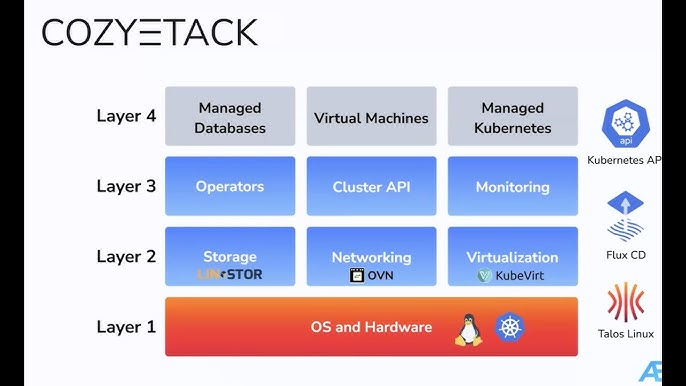

## Introduction

**Bundles** are pre-defined combinations of Cozystack components.
Each bundle is tested, versioned, and guaranteed to work as a unit.
They simplify installation, reduce the risk of misconfiguration, and make it easier to choose the right set of features for your deployment.

This guide is for infrastructure engineers, DevOps teams, and platform architects planning to deploy Cozystack in different environments.
It explains how Cozystack bundles help tailor the installation to specific needs—whether you're building a fully featured platform-as-a-service
or just need a minimal Kubernetes cluster.

## Bundles Overview

| Component                                | [paas-full]         | [iaas-full]* | [paas-hosted]  | [distro-full]         | [distro-hosted]       |
|:-----------------------------------------|:--------------------|:------------------------|:---------------|:----------------------|:----------------------|
| Cozystack Dashboard                      | ✔                   | ✔                       | ✔              | ❌                    | ❌                    |
| [Cozystack API][api]                     | ✔                   | ✔                       | ✔              | ❌                    | ❌                    |
| [Managed Applications][apps]             | ✔                   | ❌                      | ✔              | ❌                    | ❌                    |
| [Virtual Machines][vm]                   | ✔                   | ✔                       | ❌             | ❌                    | ❌                    |
| [Managed Kubernetes][k8s]                | ✔                   | ✔                       | ❌             | ❌                    | ❌                    |
| Operators                                | ✔                   | ❌                      | ✔              | ✔  (optional)         | ✔  (optional)         |
| [Monitoring subsystem]                   | ✔                   | ✔                       | ✔              | ✔  (optional)         | ✔  (optional          |
| Storage subsystem                        | [LINSTOR]           | [LINSTOR]               | ❌             | [LINSTOR]             | ❌                    |
| Networking subsystem                     | [Kube-OVN]+[Cilium] | [Kube-OVN]+[Cilium]     | ❌             | [Cilium]              | ❌                    |
| Virtualization subsystem                 | [KubeVirt]          | [KubeVirt]              | ❌             | [KubeVirt] (optional) | [KubeVirt] (optional) |
| OS and Hardware ([Talos] + [Kubernetes]) | ✔                   | ✔                       | ❌             | ✔                     | ❌                    |

* Bundle `iaas-full` is currently on the roadmap, see [cozystack/cozystack#730][iaas-full-gh].

[apps]: {}
[vm]: {}
[k8s]: {}
[api]: {}
[monitoring subsystem]: {}
[linstor]: {}
[kube-ovn]: {}
[cilium]: {}
[kubevirt]: {}
[talos]: {}
[kubernetes]: {}

[paas-full-gh]: https://github.com/cozystack/cozystack/blob/main/packages/core/platform/bundles/paas-full.yaml
[iaas-full-gh]: https://github.com/cozystack/cozystack/issues/730
[paas-hosted-gh]: https://github.com/cozystack/cozystack/blob/main/packages/core/platform/bundles/paas-hosted.yaml
[distro-full-gh]: https://github.com/cozystack/cozystack/blob/main/packages/core/platform/bundles/distro-full.yaml
[distro-hosted-gh]: https://github.com/cozystack/cozystack/blob/main/packages/core/platform/bundles/distro-hosted.yaml

[paas-full]: {}
[iaas-full]: https://github.com/cozystack/cozystack/issues/730
[paas-hosted]: {}
[distro-full]: {}
[distro-hosted]: {}

## Cozystack Composition

Cozystack is built around four layers:

- **Layer 4: User-Facing Services**: Managed Kubernetes, Databases-as-a-Service, and other managed applications.
- **Layer 3: Platform Services**: Operators, Cluster API and Dashboard, and Monitoring.
- **Layer 2: Infrastructure Services**: Storage (using LINSTOR, by default), Networking (using OVN), and Virtualization (using KubeVirt).
- **Layer 1: OS and Hardware**: The foundation, typically Talos Linux and a root Kubernetes cluster installed on Talos.

## Choosing the Right Bundle

Bundles combine components from different layers to match particular needs.
Some are designed for full platform scenarios, others for cloud-hosted workloads or Kubernetes distributions.

### `paas-full`

`paas-full` is a full-featured PaaS and IaaS bundle.
It includes all four layers and provides all Cozystack components.
Some of these components on the upper layers are optional and can be excluded from an installation.

`paas-full` is made to be installed on bare metal servers.

See the bundle source: [paas-full.yaml][paas-full-gh]

### `iaas-full` *(planned)*

- **Description**: Full infrastructure-as-a-service bundle.
- **Includes**: Layers 1–3 with strong VM and networking support.
- **Use cases**: Virtual machine hosting, private cloud.
- **Requirements**: Bare metal; similar base to `paas-full` but focused on VM workloads.

Bundle `iaas-full` is yet to be implemented in Cozystack.
See [cozystack/cozystack#730][iaas-full-gh].

### `paas-hosted`
- **Description**: PaaS on top of existing Kubernetes clusters.
- **Includes**: Layer 3 (Operators, Cluster API, Monitoring) and Layer 4 (Managed Databases).
- **Use cases**: Offering managed databases and queues on cloud clusters.
- **Requirements**: An existing Kubernetes cluster with storage and networking.

See the bundle source: [paas-hosted.yaml][paas-hosted-gh]

### `distro-full`
- **Description**: Kubernetes distribution for bare metal.
- **Includes**: Layers 1–3 (optional KubeVirt and Operators).
- **Use cases**: Deploying a production-grade Kubernetes cluster without platform features.
- **Requirements**: Bare metal servers.

See the bundle source: [distro-full.yaml][distro-full-gh]

### `distro-hosted`
- **Description**: Add monitoring and optional extras to a hosted Kubernetes cluster.
- **Includes**: Layer 3 (Monitoring, optional Operators and KubeVirt).
- **Use cases**: Enhance a cloud-provided Kubernetes cluster.
- **Requirements**: Existing Kubernetes cluster.

See the bundle source: [distro-hosted.yaml][distro-hosted-gh]

## What's Next

To see the full list of components and configuration options for each bundle, refer to the 
[bundle reference documentation]({}).

To deploy a selected bundle, follow the [Cozystack quickstart guide]({}) or platform installation documentation.

