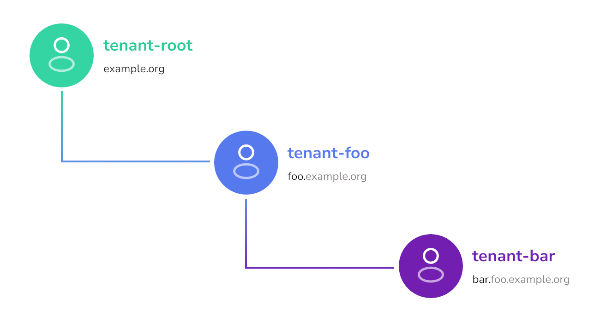

## Introduction

A **tenant** in Cozystack is the primary unit of isolation and security, analogous to a Kubernetes namespace but with enhanced scope.
Each tenant represents an isolated environment with its own resources, networking, and RBAC (role-based access control).
Some cloud providers use the term "projects" for a similar entity.

Cozystack administrators and users create tenants using the [Tenant application]({})
from the application catalog.
Tenants can be created via the Cozystack dashboard (UI), `kubectl`, or directly via Cozystack API.

### Tenant Nesting

All user tenants belong to the base `root` tenant.
This `root` tenant is used only to deploy user tenants and system components.
All user-side applications are deployed in their respective tenants.

Tenants can be nested further: an administrator of a tenant can create sub-tenants as applications in the Cozystack catalog.
Parent tenants can share their resources with their children and oversee their applications.
In turn, children can use their parent's services.

### Sharing Cluster Services

Lower-level tenants can access the cluster services of their parent in case they do not run their own.

The `root` tenant has a set of services like `etcd`, `ingress`, and `monitoring` by default.

User can can create a tenant `foo` inside of tenant `root` and a nested tenant `bar` inside of `foo`.
Let's see what happens when [tenant Kubernetes]({}) and
[Postgres]({}) applications run under the `bar` namespace.

Since tenant `bar` does not have its own cluster services like `ingress` and `monitoring`,
the applications will use the cluster services of the parent tenant `foo`.
This in turn means:

-   The tenant Kubernetes cluster data will be stored in the `bar` tenant's own etcd.
-   All metrics will be collected in the monitoring stack of the parent tenant `foo`.
-   Access to the cluster will be through the common ingress deployed in the tenant `root`.

### Unique Domain Names

Each tenant has its own domain.
By default, (unless otherwise specified), it inherits the domain of its parent with a prefix of its name.
For example, if the `root` tenant has domain `example.org`, then tenant `foo` gets the domain `foo.example.org` by default.
However, it can be redefined to have another domain, such as `example.com`.

Kubernetes clusters created in this tenant namespace would get domains like: `kubernetes-cluster.foo.example.org`

### Tenant Naming Limitations

Tenant names must be alphanumeric.
Using dashes (`-`) in tenant names is not allowed, unlike with other services.
This limitation exists to keep consistent naming in tenants, nested tenants, and services deployed in them.

For example:

-   The root tenant is named `root`, but internally it's referenced as `tenant-root`.
-   A user tenant is named `foo`, which results in `tenant-foo`.
-   However, a tenant cannot be named `foo-bar`, because parsing names like `tenant-foo-bar` can be ambiguous.

### Reference

See the reference for the application implementing tenant management: [`tenant`]({})

