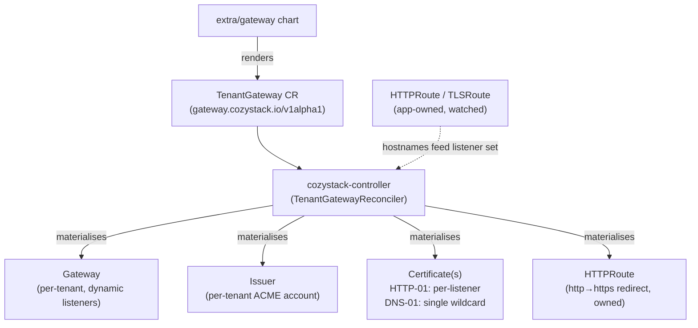
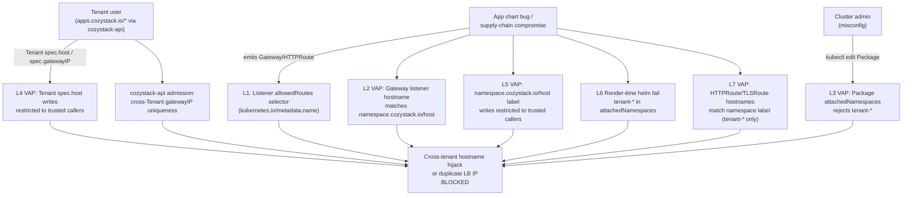

## Overview

Cozystack ships Gateway API support as an opt-in alternative to ingress-nginx. When enabled, every tenant with `spec.gateway: true` gets its own `Gateway` materialised in its own namespace, with the Cilium Gateway API controller programming Envoy-on-DaemonSet. The tenant's LoadBalancer Service draws its IP from a per-tenant MetalLB `IPAddressPool` rendered by the tenant chart in `cozy-metallb`; the cluster admin's existing `L2Advertisement` or `BGPAdvertisement` announces it to the link.

The chart does not render `Gateway`, `Issuer`, or `Certificate` resources directly. Instead it renders one `gateway.cozystack.io/v1alpha1 TenantGateway` CR per tenant, and `cozystack-controller` reconciles all the downstream Gateway API and cert-manager objects from there. This avoids the Helm-vs-controller race on `Gateway.spec.listeners` that route-driven dynamic listener materialization would otherwise cause.

This page documents the architecture, the two-step opt-in, the cert-mode choice (HTTP-01 default vs DNS-01 wildcard opt-in), the three-group security model, and the migration story from ingress-nginx.

Gateway API and ingress-nginx coexist on the same cluster — the two modes are selected per service / per tenant, not globally. Existing clusters upgrade with `gateway.enabled=false` and see no behavioural change.

### Tenant API surface

Tenants in Cozystack interact with the platform exclusively through `apps.cozystack.io/*` resources (Tenant, Bucket, Kubernetes, …) served by `cozystack-api`. Tenant RBAC (`cozy:tenant:*` aggregated to a RoleBinding in the tenant's own namespace) does not grant write access to `gateway.networking.k8s.io/*`, core `Namespaces`, or `cozystack.io/Package`. The security model below is built around that constraint — tenants do not write Gateways or HTTPRoutes directly, so most of its layers protect against chart bugs, controller bugs, supply-chain compromise, and cluster-admin mistakes rather than against tenant-user input.

## Architecture

### Reconciliation flow



The controller:

- Materialises the `Gateway`, the per-tenant `Issuer`, the redirect HTTPRoute, and the Certificate(s) from `TenantGateway.spec`.
- Watches `HTTPRoute` and `TLSRoute` resources cluster-wide. For each route attached to its Gateway, it picks up the hostnames and (in HTTP-01 mode) appends a per-app HTTPS listener + a per-app `Certificate`.
- Resolves cross-namespace hostname conflicts: `cozy-*` namespaces (cluster-admin-managed platform services) win over tenant namespaces; the loser receives a `HostnameConflict` condition under the controller's name in `Status.Parents`.
- Refuses to silently take over pre-existing `Gateway`, `Issuer`, `Certificate`, or redirect `HTTPRoute` objects that share the controller-derived name but carry no `OwnerReference` back to the TenantGateway. Operators see an explicit `Ready=False/ReconcileError` condition instead of having their hand-pinned config rewritten.

### Traffic path

```mermaid
flowchart LR
    CLIENT["External client"]
    LB["MetalLB IPAddressPool<br/>(per-tenant /32 in cozy-metallb,<br/>label cozystack.io/per-tenant-gateway=true)"]
    ENV["cilium-envoy DaemonSet<br/>(L7 termination / L4 passthrough)"]
    GW["Gateway 'cozystack'<br/>(per-tenant namespace)"]
    HTR["HTTPRoute<br/>dashboard, keycloak, harbor, bucket, ..."]
    TLR["TLSRoute<br/>kubernetes-api, vm-exportproxy,<br/>cdi-uploadproxy"]
    CM["cert-manager<br/>(per-tenant Issuer + Certificate(s))"]
    SVC["Service<br/>(backend)"]

    CLIENT -->|DNS → LB IP| LB
    LB --> ENV
    ENV --> GW
    GW --> HTR
    GW --> TLR
    HTR --> SVC
    TLR --> SVC
    CM -.->|issues Certificate(s)| GW
```

- **One `GatewayClass cilium`** cluster-wide. There is no per-tenant GatewayClass, so no tenant can hijack the class by naming theirs after someone else.
- **One `Gateway` per tenant** in the tenant's own namespace. All listeners for that tenant live on a single Gateway object; there is no cross-Gateway merge.
- **Envoy** runs as a Cilium DaemonSet (`cilium.envoy.enabled=true`) and handles both TLS termination (HTTPS listeners) and TLS passthrough (dedicated per-service listeners for the kubeapiserver and the KubeVirt VM export / CDI upload proxies).
- **LoadBalancer IP** is assigned by MetalLB from a per-tenant `IPAddressPool` (rendered by the tenant chart in `cozy-metallb`, label `cozystack.io/per-tenant-gateway: "true"`, `serviceAllocation.namespaces` scoped to the tenant). The TenantGateway controller writes `metallb.universe.tf/address-pool=<tenant-namespace>-gateway` on `Gateway.spec.infrastructure.annotations`; Cilium's Gateway-API controller forwards that annotation to the auto-created Service via [GEP-1762](https://gateway-api.sigs.k8s.io/geps/gep-1762/), and MetalLB allocates the IP held by the pool. Advertisement (L2 / BGP) is admin-side and out of scope of the chart.

### Listener layout on a tenant Gateway

A tenant Gateway always materialises an HTTP listener:

| # | Name | Protocol | Port | Hostname | Purpose |
|---|---|---|---|---|---|
| 1 | `http` | `HTTP` | 80 | none (wildcard) | ACME `/.well-known/acme-challenge/*` + HTTP→HTTPS redirect HTTPRoute |

Plus HTTPS listeners that depend on cert mode:

- **HTTP-01 mode (default):** one HTTPS listener per attached HTTPRoute hostname, named `https-<first-label>-<8-hex>`. The hex suffix is the first 32 bits of `sha256(hostname)` so two different hostnames sharing the same first label (`harbor.foo.example.com` vs `harbor.alice.example.com`) get distinct listener names. Each listener's `tls.certificateRefs` points at a per-listener `Certificate` named `<tgw>-<first-label>-<8-hex>-tls`, also auto-issued.
- **DNS-01 mode (opt-in):** two HTTPS listeners — `https` (`*.<tenant host>`) and `https-apex` (`<tenant host>`) — both consuming a single wildcard Certificate.

Plus one extra listener per TLS-passthrough service (see [TLS passthrough](#tlsroute-tls-passthrough)).

The plain-HTTP listener (port 80) carries a strictly narrower `allowedRoutes.namespaces` selector than the HTTPS listeners — only the tenant namespace itself (where the controller-owned redirect HTTPRoute lives) and `cozy-cert-manager` (HTTP-01 ACME challenge HTTPRoutes). App HTTPRoutes attaching to the Gateway by hostname therefore cannot bind to port 80 and serve plaintext. HTTPS listeners further restrict `allowedRoutes.kinds` to `HTTPRoute` (and TLS-passthrough listeners to `TLSRoute`), preventing GRPCRoute / TCPRoute / UDPRoute from attaching outside the route-hostname VAP's coverage.

## Enabling Gateway API

Gateway API is opt-in at two levels. Both defaults stay `false`; upgrades do not flip tenants silently.

### 1. Platform-level flag

Set `gateway.enabled: true` on the `cozystack.cozystack-platform` Package:

```yaml
apiVersion: cozystack.io/v1alpha1
kind: Package
metadata:
  name: cozystack.cozystack-platform
spec:
  variant: isp-full
  components:
    platform:
      values:
        publishing:
          host: example.org
        gateway:
          enabled: true
          attachedNamespaces:
            - cozy-cert-manager
            - cozy-dashboard
            - cozy-keycloak
            - cozy-system
            - cozy-harbor
            - cozy-bucket
            - cozy-kubevirt
            - cozy-kubevirt-cdi
            - cozy-monitoring
            - cozy-linstor-gui
            - default
```

The `default` namespace is included because the Kubernetes API `TLSRoute` (shipped by the cozystack-api package) lives next to the `kubernetes` Service it points at, which is always in `default`.

Flipping `gateway.enabled=true` wires three things:

- cert-manager `ClusterIssuer.spec.acme.solvers` switches from `http01.ingress.ingressClassName` to `http01.gatewayHTTPRoute` that attaches to the publishing tenant's Gateway.
- The exposed-service templates (dashboard, keycloak) stop rendering their `Ingress` and start rendering their `HTTPRoute`.
- TLS-passthrough services (cozystack-api, vm-exportproxy, cdi-uploadproxy) stop rendering their `Ingress` and start rendering a `TLSRoute` attached to a dedicated Passthrough listener.

The `attachedNamespaces` list restricts which namespaces may attach `HTTPRoute` or `TLSRoute` to tenant Gateways through the listener `allowedRoutes` whitelist (see [Security](#security)). It is also guarded by a runtime `ValidatingAdmissionPolicy` that rejects any `tenant-*` entry, plus a render-time helm `fail` for the same.

### 2. Per-tenant Gateway

A tenant gets its own `TenantGateway` CR (and through the controller, its `Gateway`, `Issuer`, `Certificate`(s) and per-tenant MetalLB `IPAddressPool`) automatically when its apex is derived from the parent — i.e. `tenant.spec.host` is left unset and the chart computes `<tenant name>.<parent apex>`. The implicit assumption is that derived-apex tenants want their URLs routable; forcing operators to also set `tenant.spec.gateway: true` would be a needless extra step.

```yaml
apiVersion: apps.cozystack.io/v1alpha1
kind: Tenant
metadata:
  name: alice
  namespace: tenant-root
spec: {}  # gateway auto-on, host derived as alice.<parent apex>
```

For tenants with a custom non-derived apex (independent domain like `customer1.io`, not a subdomain), the operator made a deliberate apex choice — keep explicit opt-in to avoid surprising LB IP / ACME registration on tenants the operator may not have intended to expose:

```yaml
apiVersion: apps.cozystack.io/v1alpha1
kind: Tenant
metadata:
  name: acme
  namespace: tenant-root
spec:
  host: customer1.io
  gateway: true   # required: custom apex does not auto-default
```

Operators who specifically want a derived-apex tenant without a Gateway (e.g. a dev sandbox without external exposure) opt out explicitly:

```yaml
spec:
  gateway: false  # escape hatch — disables the auto-on default
```

Setting `tenant.spec.host` to a custom value is reserved for cluster-admins and cozystack/Flux service accounts (enforced runtime by `cozystack-tenant-host-policy`, see [Security](#security)).

A tenant Gateway, regardless of how it was opted in, is its own per-tenant boundary: separate `Gateway`, separate `Issuer` and ACME account, separate `Certificate`(s) — child tenants do not share HTTP-01 challenge state with the parent or with siblings. There is no "share the parent's Gateway" mode; per-tenant Gateway is a deliberate isolation property of the security model.

### 3. Per-tenant Gateway IP

Every tenant Gateway gets its own LoadBalancer Service. At the Cilium Gateway-API layer every tenant Gateway claims `443/TCP`, sharing-key is therefore inactive (pending [Cilium ListenerSet](https://github.com/cilium/cilium/issues/42756)), and **one IP per tenant Gateway is required** — not optional pinning. The publishing tenant declares the address via `tenant.spec.gatewayIP`:

```yaml
apiVersion: apps.cozystack.io/v1alpha1
kind: Tenant
metadata:
  name: acme
  namespace: tenant-root
spec:
  host: customer1.io
  gateway: true
  gatewayIP: "203.0.113.42"
```

The tenant chart renders a per-tenant `metallb.io/v1beta1 IPAddressPool` in `cozy-metallb` carrying that single `/32` (or `/128` for IPv6), labeled `cozystack.io/per-tenant-gateway: "true"`, with `serviceAllocation.namespaces` scoped to the tenant. The TenantGateway controller writes `metallb.universe.tf/address-pool=<tenant-namespace>-gateway` on `Gateway.spec.infrastructure.annotations`; Cilium's Gateway-API controller forwards the annotation to the auto-created Service via [GEP-1762](https://gateway-api.sigs.k8s.io/geps/gep-1762/), and MetalLB allocates the IP held by the pool.

L2/BGP advertisement is admin-side and out of scope of the chart. A cluster-wide `L2Advertisement` or `BGPAdvertisement` (no `ipAddressPools` selector → applies to all pools) covers per-tenant pools automatically. To target specifically the cozystack-managed pools, select on the `cozystack.io/per-tenant-gateway=true` label:

```yaml
apiVersion: metallb.io/v1beta1
kind: L2Advertisement
metadata:
  name: cozystack-per-tenant-gateway
  namespace: cozy-metallb
spec:
  ipAddressPoolSelectors:
  - matchLabels:
      cozystack.io/per-tenant-gateway: "true"
```

`tenant.spec.gatewayIP` values must be globally unique across all Tenants in the cluster — overlap is rejected at admission time by `cozystack-api` (a duplicate IP would leave one tenant's Gateway in `<pending>` indefinitely, since MetalLB allocates the IP to whichever Service it programs first and never re-binds). The check uses `net/netip` canonicalisation, so `192.0.2.10`, `192.0.2.10/32`, ` 192.0.2.10 `, and IPv6 alternate forms (`2001:db8::1` vs `2001:db8:0:0:0:0:0:1`) all resolve to the same key. Unparseable input and CIDR prefixes wider than `/32` (IPv4) or `/128` (IPv6) are rejected with the exact bad value echoed back. The check is best-effort under strict concurrency: two simultaneous `kubectl apply` calls against different `cozystack-api` replicas can both pass admission. Operators sequencing tenant rollouts via GitOps see no race in practice; concurrent CI pipelines should serialise tenant creation when assigning IPs from a shared pool.

The chosen IP must fall inside an admin-managed announcer range. MetalLB allocates the IP from the per-tenant pool regardless, but without an announcer covering that pool the IP never reaches the link.

## Cert mode: HTTP-01 (default) vs DNS-01 (opt-in)

`publishing.certificates.solver` controls how the per-tenant Issuer sources TLS certs.

### HTTP-01 (default)

Out of the box, no extra config required. The controller:

- Renders an ACME `Issuer` in the tenant namespace with an `http01.gatewayHTTPRoute` solver pointing at the tenant's own Gateway / `http` listener.
- Watches HTTPRoutes / TLSRoutes attached to the Gateway (parentRefs pointing at it). For each unique hostname seen, it adds a per-app HTTPS listener and a per-app `Certificate` (dnsNames containing exactly that hostname).
- Per-app listener naming: `https-<first-label>-<8-hex>` (e.g. `https-harbor-deadbeef`).
- Per-app cert naming: `<tgw>-<first-label>-<8-hex>-tls`.

Adding a new published app is purely a matter of deploying its HTTPRoute — no edits to the platform Package or to `_cluster.expose-services` needed.

### DNS-01 (opt-in)

Set `publishing.certificates.solver: dns01` and pick a provider:

| `publishing.certificates.dns01.provider` | Required `publishing.certificates.dns01.<provider>` keys |
|---|---|
| `cloudflare` (default) | `cloudflare.secretName`, `cloudflare.secretKey` |
| `route53` | `route53.region`, `route53.secretName` (and `route53.accessKeyID` if not running with IRSA) |
| `digitalocean` | `digitalocean.secretName` |
| `rfc2136` | `rfc2136.nameserver`, `rfc2136.tsigKeyName`, `rfc2136.secretName` |

Each provider sub-block carries safe defaults for secret-key field names (`api-token`, `secret-access-key`, `access-token`, `tsig-secret-key`) so the typical opt-in is `solver: dns01` plus the provider-specific `secretName` (and `region` for route53 / `nameserver`+`tsigKeyName` for rfc2136).

DNS-01 mode renders a single wildcard `Certificate` covering `<apex>` and `*.<apex>`, plus the corresponding `https` (`*.<apex>`) and `https-apex` (`<apex>`) listeners. New apps published under the apex pick up the existing wildcard cert without per-listener provisioning.

The platform chart writes the provider config into `_cluster.dns01-*` keys consumed by both the per-tenant gateway chart (rendering the TenantGateway CR) and the cluster-wide `letsencrypt-prod` / `letsencrypt-stage` ClusterIssuers used by the legacy ingress flow. Both paths agree on which provider is active.

Pick DNS-01 when you specifically want a wildcard cert (e.g. a long-lived staging cluster with many short-lived apps and tight Let's Encrypt rate limits). Otherwise stay on HTTP-01.

## Per-service routing

When `gateway.enabled=true`, the following services switch from `Ingress` to Gateway API resources:

### HTTPRoute (TLS termination on Gateway)

| Service | Namespace | `HTTPRoute` name | Backend | Listener |
|---|---|---|---|---|
| dashboard | `cozy-dashboard` | `dashboard` | `incloud-web-gatekeeper:8000` | per-app `https-dashboard-...` (HTTP-01) or `https` (DNS-01) |
| keycloak | `cozy-keycloak` | `keycloak` | `keycloak-http:80` | same |
| harbor | tenant namespace | `<release-name>` | `<release-name>:80` | tenant's own Gateway |
| bucket | tenant namespace | `<bucket-name>-ui` | `<bucket-name>-ui:8080` | tenant's own Gateway |

cert-manager's HTTP-01 solver places its short-lived `HTTPRoute` on the `http` listener of the same Gateway, path-matched to `/.well-known/acme-challenge/`. More-specific path matching wins over the catch-all HTTP→HTTPS redirect HTTPRoute.

### TLSRoute (TLS passthrough)

Services that need SNI-based passthrough (clients present certificates, backend terminates TLS) use `TLSRoute` on a dedicated Passthrough listener. One listener per service, hostname scoped to that service's FQDN:

| Service | Namespace | `TLSRoute` name | Backend | Listener |
|---|---|---|---|---|
| Kubernetes API | `default` | `kubernetes-api` | `kubernetes:443` | `tls-api` |
| KubeVirt VM export | `cozy-kubevirt` | `vm-exportproxy` | `vm-exportproxy:443` | `tls-vm-exportproxy` |
| KubeVirt CDI upload | `cozy-kubevirt-cdi` | `cdi-uploadproxy` | `cdi-uploadproxy:443` | `tls-cdi-uploadproxy` |

The Passthrough listener is added to the Gateway only if the corresponding service appears in `publishing.exposedServices`.

`TLSRoute` is shipped from the Gateway API experimental channel (CRD `gateway.networking.k8s.io/v1alpha2`) in v1.5.x. It graduates to `v1` upstream; Cozystack will follow the rename when it lands.

## Security

The protections below split into three groups by who they defend against. Tenants in Cozystack do not write Gateway API resources directly (see [Tenant API surface](#tenant-api-surface) above), so most of the seven layers below are not protecting against tenant-user input — they guard against bugs in cozystack-controller / Flux, supply-chain compromise of an app chart, and confused-deputy mistakes by a cluster admin. All admission-time checks are fail-closed (`failurePolicy: Fail`, `validationActions: [Deny]`).

**Tenant-user-input gates** — Layer 4 (`cozystack-tenant-host-policy`) plus the cross-Tenant `gatewayIP` overlap check in `cozystack-api`'s admission chain (`pkg/registry/apps/application/rest.go`). `Tenant.spec.host` and `Tenant.spec.gatewayIP` are the two user-supplied fields that surface as a security boundary at the LB / hostname layer; both are gated on every Create / Update.

**Defense-in-depth** — Layers 1, 2, 5, 6, 7. These cover chart bugs, controller bugs, supply-chain compromise, and confused-deputy admin mistakes. They do not protect against tenant-user input because the relevant RBAC isn't granted in the first place.

**Admin-against-themselves** — Layer 3 (`cozystack-gateway-attached-namespaces-policy`). Rejects a `kubectl edit packages.cozystack.io` that would slip a `tenant-*` entry into the platform Package's `gateway.attachedNamespaces`. Layer 6 catches the same misconfiguration at helm render time.



### Layer 1 — Listener `allowedRoutes` namespace whitelist

Every listener on a tenant Gateway pins `allowedRoutes.namespaces.from: Selector` to a `matchExpressions` whitelist against the built-in `kubernetes.io/metadata.name` label. That label is written by kube-apiserver on every namespace and cannot be spoofed.

The whitelist on **HTTPS / TLS-passthrough listeners** is the publishing tenant's namespace plus `gateway.attachedNamespaces`. The whitelist on the **plain-HTTP listener (port 80)** is strictly narrower — only the tenant namespace itself plus `cozy-cert-manager` (where HTTP-01 challenge HTTPRoutes are published). App HTTPRoutes attaching by hostname therefore cannot bind to port 80 and silently serve plaintext.

HTTPS listeners additionally restrict `allowedRoutes.kinds` to `HTTPRoute` (TLS-passthrough listeners to `TLSRoute`), preventing `GRPCRoute` / `TCPRoute` / `UDPRoute` from attaching outside the Layer 7 VAP's coverage.

### Layer 2 — `cozystack-gateway-hostname-policy`

`ValidatingAdmissionPolicy` scoped to `gateway.networking.k8s.io/v1 Gateway` CREATE/UPDATE. CEL reads `namespaceObject.metadata.labels["namespace.cozystack.io/host"]` and rejects any listener whose hostname is not equal to that value or a subdomain of it. `matchConditions` gate the VAP to cozystack-managed namespaces only — Gateways in unrelated namespaces (e.g. `kube-system`) are not touched.

Because the VAP reads the namespace label (not a cluster-wide ConfigMap), a tenant with a fully independent apex domain (e.g. `customer1.io`, not a subdomain of the platform apex) is validated correctly — the VAP does not assume a subdomain hierarchy.

### Layer 3 — `cozystack-gateway-attached-namespaces-policy`

`ValidatingAdmissionPolicy` scoped to `cozystack.io/v1alpha1 Package` CREATE/UPDATE. CEL walks `spec.components.platform.values.gateway.attachedNamespaces` and rejects any entry starting with `tenant-`. Catches `kubectl edit packages.cozystack.io` that would bypass the helm render-time guard in Layer 6.

### Layer 4 — `cozystack-tenant-host-policy`

`ValidatingAdmissionPolicy` scoped to `apps.cozystack.io/v1alpha1 Tenant` CREATE/UPDATE. Rejects setting or changing `spec.host` unless the caller is in the `system:masters` group or is one of `system:serviceaccounts:cozy-system`, `system:serviceaccounts:cozy-cert-manager`, `system:serviceaccounts:cozy-fluxcd`, `system:serviceaccounts:kube-system`. Tenants can still create tenants with empty `spec.host` (normal inheritance flow).

This closes the path where a tenant user creates a Tenant with `spec.host=dashboard.example.org` to have the tenant chart write a hijacked label into their namespace.

### Layer 5 — `cozystack-namespace-host-label-policy`

`ValidatingAdmissionPolicy` scoped to core `v1 Namespace` CREATE/UPDATE. Rejects any set or change of the `namespace.cozystack.io/host` label, except by the same trusted-caller whitelist as Layer 4. Closes both first-time label writes on CREATE and first-time adds on UPDATE — only cozystack/Flux service accounts (which apply the tenant chart) can stamp the label.

Combined with Layer 4, a tenant user cannot rewrite their host through either the Tenant CR or the namespace label.

### Layer 6 — Render-time `fail` in cozystack-basics

The cozystack-basics chart fails the helm render if `_cluster.gateway-attached-namespaces` contains any `tenant-*` entry. Triggers on the helm-install path before the cluster ever sees the values; complements Layer 3 which triggers at `kubectl apply` time.

### Layer 7 — `cozystack-route-hostname-policy`

`ValidatingAdmissionPolicy` scoped to `gateway.networking.k8s.io/v1 HTTPRoute` and `v1alpha2 TLSRoute` CREATE/UPDATE. Scoped to `tenant-*` namespaces (cozy-* are cluster-admin-managed and trusted to publish under any apex). Rejects any `spec.hostnames` entry that is not equal to the namespace's `namespace.cozystack.io/host` label or a subdomain of it. **Fail-closed when the label is absent** — a `tenant-*` namespace without `namespace.cozystack.io/host` is rejected, not silently allowed.

Defense-in-depth against an app chart bug or supply-chain compromise that emits Gateway API resources outside the tenant's apex — tenants in Cozystack do not hold `gateway.networking.k8s.io/*` RBAC by design (see [Tenant API surface](#tenant-api-surface)), so this is not a tenant-user defense. The within-apex cross-namespace case (a tenant chart claiming a hostname owned by a `cozy-*` app) is handled by the controller at reconcile time — see [HostnameConflict resolution](#hostnameconflict-resolution) below.

For `tenant-root` the allowed host suffix is `publishing.host`; for any `tenant-<name>` that inherits from its parent the suffix is `<name>.<parent apex>`. A child tenant with an independent apex (`customer1.io` instead of a subdomain) is handled correctly because the VAP reads the per-namespace label rather than assuming a subdomain hierarchy.

### HostnameConflict resolution

When two routes from different namespaces claim the same hostname, the controller picks the winner deterministically:

- A route from a `cozy-*` namespace (cluster-admin-managed platform service) wins over a route from any other namespace.
- Within the same priority tier, the route with the lexicographically smallest `<namespace>/<name>` pair wins.

The losing route receives `Accepted=False` with `Reason=HostnameConflict` in `Status.Parents` under the controller's name (`gateway.cozystack.io/tenantgateway-controller`). Other controllers' status entries (Cilium etc.) are left untouched.

### Foreign-takeover guards

Five reconcile paths refuse to silently rewrite a pre-existing object that shares the controller-derived name but carries no `OwnerReference` back to the TenantGateway:

- `Gateway` (named after the TenantGateway)
- redirect `HTTPRoute` (`<tgw>-http-redirect`)
- per-tenant `Issuer` (`<tgw>-gateway`)
- wildcard `Certificate` (`<tgw>-gateway-tls`, DNS-01 mode)
- per-listener `Certificate` (`<tgw>-<first-label>-<8-hex>-tls`, HTTP-01 mode)

An operator who hand-pinned a Certificate or Issuer at the controller's derived name (private CA, manual cert pinning, internal ACME) gets an explicit `Ready=False/ReconcileError` condition on the TenantGateway instead of having their config silently destroyed and the resource re-issued from a different ACME account. The error message points at the offending object so the operator can either delete it (handing ownership to the controller) or rename it.

### What this does NOT defend

These residuals are design choices, not runtime gaps:

- **Cluster-admin credentials.** Anyone in `system:masters` or with a matching cozystack/Flux SA can set any host. Gateway API isolation is not the weakest link at that trust level.
- **DNS control.** A tenant whose VAP-allowed hostname does not resolve to the cluster's LB IP cannot complete ACME HTTP-01. No Certificate is issued; no hijack even if admission somehow admitted the Gateway. ACME's DNS-based identity proof is the last line.
- **Per-tenant LB IP.** Each tenant Gateway requires its own `gatewayIP` (declared in `tenant.spec.gatewayIP`); MetalLB allocates from a per-tenant `IPAddressPool` rendered by the chart. Cross-Tenant overlap is rejected at admission time. Operators planning multiple opted-in tenants should reserve a `/32` (or `/128`) per Gateway from a pool covered by the cluster's existing `L2Advertisement` or `BGPAdvertisement`.

## Certificates

Every tenant with `spec.gateway: true` gets its own cert-manager `Issuer` (namespace-scoped, not `ClusterIssuer`) named `<tgw>-gateway`. The Issuer carries its own ACME account via `privateKeySecretRef: <tgw>-acme-account`. Certificates reference `issuerRef.kind: Issuer, name: <tgw>-gateway`.

In **HTTP-01 mode**, one Certificate per published-app hostname (named `<tgw>-<first-label>-<8-hex>-tls`). In **DNS-01 mode**, a single wildcard Certificate (named `<tgw>-gateway-tls`) covers `<apex>` and `*.<apex>`.

Two ACME servers are supported out of the box:

- `publishing.certificates.issuerName: letsencrypt-prod` → `https://acme-v02.api.letsencrypt.org/directory`
- `publishing.certificates.issuerName: letsencrypt-stage` → `https://acme-staging-v02.api.letsencrypt.org/directory`

Any other value fails the chart render with a pointer to the controller's renderer (`internal/controller/tenantgateway/renderers.go`) for how to add a new mapping.

### Rate limits

Let's Encrypt enforces per-account and per-registered-domain quotas:

- 50 new certificates per registered domain per week
- 5 duplicate certificates per week for the same hostname set
- 300 new orders per account per 3 hours

A cluster where many tenants share the same apex domain can exhaust these quickly, especially in HTTP-01 mode where each published app contributes one certificate. Mitigations:

- `publishing.certificates.issuerName: letsencrypt-stage` for non-production clusters (staging quotas do not affect prod).
- `tenant.spec.resourceQuotas.count/certificates.cert-manager.io` to cap per-tenant certificate creations.
- Switch to DNS-01 to consolidate every tenant's apps under one wildcard cert (cuts cert count from N apps to 1).
- For air-gapped deployments, use the bundled `selfsigned-cluster-issuer` or an internal ACME server.

Recommended tenant-level quota to contain a misbehaving tenant:

```yaml
apiVersion: apps.cozystack.io/v1alpha1
kind: Tenant
spec:
  gateway: true
  resourceQuotas:
    count/certificates.cert-manager.io: "10"
```

## Migration from ingress-nginx

The two modes coexist. Switching happens per cluster (`gateway.enabled`) and per tenant (`tenant.spec.gateway`), not globally.

### LB allocator prerequisites

Tenant Gateway requires a working LoadBalancer allocator. Cozystack ships MetalLB installed by default; the tenant chart renders per-tenant `IPAddressPool` resources in `cozy-metallb`, but L2/BGP advertisement is admin-side and out of scope of the chart.

Before enabling Gateway API on a tenant, verify the cluster has at least one `L2Advertisement` or `BGPAdvertisement` whose selector covers per-tenant pools. The simplest configuration is a cluster-wide L2 advertisement matched on the `cozystack.io/per-tenant-gateway` label:

```yaml
apiVersion: metallb.io/v1beta1
kind: L2Advertisement
metadata:
  name: cozystack-per-tenant-gateway
  namespace: cozy-metallb
spec:
  ipAddressPoolSelectors:
  - matchLabels:
      cozystack.io/per-tenant-gateway: "true"
```

For BGP-routed environments, swap the kind to `BGPAdvertisement` and pair it with one or more `BGPPeer` resources. MetalLB allocates the per-tenant IP regardless of advertisement state — a missing or mis-selecting advertisement is the most common cause of a `<pending>` Service.

### For a new cluster

Set both flags at install time. Ingress-nginx can be disabled entirely:

```yaml
gateway:
  enabled: true
publishing:
  exposure: loadBalancer  # ingress-nginx also moves off Service.spec.externalIPs
```

Tenants then enable `spec.gateway: true` at creation time. Each tenant must declare its `tenant.spec.gatewayIP` (per-tenant IP is required by design — see [Per-tenant Gateway IP](#3-per-tenant-gateway-ip) above).

### `publishing.exposure` — ingress-nginx Service mode

`publishing.exposure` controls how the ingress-nginx `Service` itself is provisioned. It is **independent** of `gateway.enabled` — Gateway API always uses per-tenant MetalLB `IPAddressPool` resources regardless of this flag, while ingress-nginx (still in place for unmigrated tenants and for chart-level features that have not yet moved) follows `publishing.exposure` for its own Service shape. A Gateway API rollout is a natural moment to flip `exposure` so both flows draw from the same allocator family.

| Value                   | Service shape                                                                  | IP source                                                                                            |
| ----------------------- | ------------------------------------------------------------------------------ | ---------------------------------------------------------------------------------------------------- |
| `externalIPs` (default) | `ClusterIP` with `Service.spec.externalIPs` set from `publishing.externalIPs`  | Operator-managed routing of those IPs to a cluster node                                              |
| `loadBalancer`          | `type: LoadBalancer`                                                           | Cilium LB IPAM allocates from a `CiliumLoadBalancerIPPool` populated with `publishing.externalIPs` (legacy ingress-nginx flow; tenant Gateway uses MetalLB pools instead — see [Per-tenant Gateway IP](#3-per-tenant-gateway-ip))   |

`Service.spec.externalIPs` is deprecated upstream in Kubernetes v1.36 ([KEP-5707](https://github.com/kubernetes/enhancements/issues/5707)). The `AllowServiceExternalIPs` feature gate is expected to default to `false` around v1.40 and the implementation removed around v1.43 — switch to `loadBalancer` before upgrading past v1.40.

Caveats for `loadBalancer` mode:

- `publishing.externalIPs` must contain at least one non-empty address; otherwise the chart render fails fast (a LoadBalancer Service without a pool would sit in `<pending>` forever).
- The ingress-nginx Service is created with `externalTrafficPolicy: Local` to preserve the client source IP. The external IP must therefore be routed to a node that runs an ingress-nginx pod (floating IP, keepalived, upstream router, or `podAntiAffinity` to constrain pod placement).
- Cilium does not announce the IP on its own unless L2 announcements or BGP are enabled in Cilium values (disabled by default in Cozystack). This mode assumes the operator already routes `publishing.externalIPs` to a cluster node. **Exception**: `tenant.spec.gateway=true` with empty `publishing.externalIPs` and `exposure=loadBalancer` is a legitimate operator pattern (Cilium picks IPs from a cluster-wide BGP / L2-announce pool managed outside this chart) — the chart skips the per-tenant pool render rather than failing.
- Switching this value on a running cluster recreates the ingress-nginx Service (the kind changes between `ClusterIP` and `LoadBalancer`, and the `HelmRelease` has `upgrade.force: true`). Expect a brief ingress traffic interruption.
- Scope: this setting controls only the ingress-nginx Service. Other components that write `Service.spec.externalIPs` directly (for example `packages/apps/vpn/templates/service.yaml`) are unaffected and must be migrated separately before the `AllowServiceExternalIPs` gate flips off.

### For an existing cluster

1. Flip `gateway.enabled: true` on the platform Package. This rerenders cert-manager ClusterIssuers and the exposed-service templates. Existing `Ingress` objects for dashboard / keycloak / cozystack-api (Kubernetes API) / vm-exportproxy / cdi-uploadproxy are deleted by Flux as they are replaced by `HTTPRoute` / `TLSRoute`.
2. For each tenant that should move to Gateway API, set `tenant.spec.gateway: true`. The tenant chart materialises the `TenantGateway` CR; the controller reconciles the rest.
3. Verify: `kubectl -n <tenant-ns> wait gateway/cozystack --for=condition=Programmed`, then `kubectl -n <tenant-ns> get certificate` (one wildcard in DNS-01 mode, one per published app in HTTP-01 mode) and `kubectl -n <tenant-ns> wait certificate/<cert-name> --for=condition=Ready`.
4. Once every tenant has migrated, the `cozystack.ingress-application` package source can be removed from the system bundle — ingress-nginx deployment is no longer required.

Applications that live in upstream vendored charts (harbor, bucket) attach to their tenant's Gateway through `_namespace.gateway`, which the tenant chart populates automatically once `spec.gateway: true` is set.

## Known limitations

- **Tenant IP allocation from a shared pool.** `publishing.externalIPs` is cluster-wide. Tenants with `gateway: true` compete for addresses. Operators running multi-tenant deployments should subset IPs per tenant — Cozystack does not partition the list automatically.
- **TLSRoute v1alpha2.** Gateway API v1.5 ships TLSRoute at `v1alpha2`. It graduates to `v1` upstream; Cozystack will follow the rename when it lands.
- **Inheritance from parent Gateway.** Child tenants currently must opt into their own Gateway via `tenant.spec.gateway=true`. There is no "share the parent's Gateway" mode; per-tenant Gateway is a deliberate isolation property of the security model. Inheritance may land later behind an explicit `tenant.spec.gatewayInheritFromParent` flag, paired with extensions to Layers 5 and 7.
- **Supported ACME issuers.** `publishing.certificates.issuerName` must be `letsencrypt-prod` or `letsencrypt-stage` (the controller maps those to ACME server URLs). To support another ACME provider, extend the controller's renderer with an additional branch.
- **`tenant.spec.host` enforcement.** A tenant cannot set their own host (runtime-blocked), but a cluster-admin who misconfigures it produces a tenant publishing a hostname they do not own. ACME will fail (no DNS control), so no cert is issued and no hijack materialises, but the diagnostics stop at "Certificate stuck in Pending".
- **Upstream application features.** Some chart-level features in harbor / bucket still rely on ingress-nginx annotations upstream. Cozystack tracks those as upstream PRs; they remain the reason some ops teams will keep ingress-nginx alongside Gateway API for a while.

## Troubleshooting

### TenantGateway stuck in `Ready=False` with `ReconcileError`

```bash
kubectl -n <tenant-ns> describe tenantgateway cozystack
```

The status condition's message names the failing step. Common cases:

- `gateway <ns>/cozystack exists but is not owned by TenantGateway ...` — a pre-existing Gateway with our derived name was found and refused. Rename or delete the foreign Gateway, or set its `OwnerReference` to the TenantGateway by hand if you intend to take ownership.
- `issuer <ns>/<tgw>-gateway exists but is not owned ...` — same shape for a foreign Issuer.
- `certificate <ns>/... exists but is not owned ...` — same for a foreign Certificate.

### Gateway stuck in `Programmed=False`

```bash
kubectl -n cozy-cilium logs deploy/cilium-operator --tail=100 | grep -i gateway
```

Common causes: `gatewayClassName` typo (must be exactly `cilium`), a listener that collides with another listener (same port + protocol + hostname), or an HTTPS listener whose `certificateRefs` points at a Secret that does not exist yet.

### Certificate stuck in `Ready=False`

```bash
kubectl -n <tenant-ns> describe certificate <cert-name>
kubectl -n <tenant-ns> describe challenge
```

If the Challenge's `HTTPRoute` has `Accepted=False`, the HTTP listener's `allowedRoutes` whitelist does not include the Challenge's namespace — expected to be `cozy-cert-manager`, always implicitly in the list. If the Challenge reports ACME server errors, check DNS: `<host>` (HTTP-01) or `<apex>` and `*.<apex>` (DNS-01) must resolve to the Gateway's LB IP / be answered by the configured DNS-01 provider.

### HTTPRoute rejected with `HostnameConflict`

```bash
kubectl -n <tenant-ns> describe httproute <route-name>
```

Look for an entry under `Status.Parents` with `controllerName: gateway.cozystack.io/tenantgateway-controller` and `Reason: HostnameConflict`. The message names the conflicting hostname(s) and the route that owns them. Within-apex conflicts are resolved with `cozy-*` priority; the loser must use a different hostname.

### Admission denied: "Gateway listener hostname must equal..."

Layer 2 (`cozystack-gateway-hostname-policy`) rejected the Gateway because a listener hostname does not match `namespace.cozystack.io/host` on the Gateway's namespace. Fix the listener hostname, or (if the namespace label is wrong) update the tenant's `spec.host` via a trusted caller.

### Admission denied: "HTTPRoute hostnames must equal..."

Layer 7 (`cozystack-route-hostname-policy`) rejected the HTTPRoute or TLSRoute because a hostname falls outside the apex of the namespace's `namespace.cozystack.io/host` label. Either change the hostname to live under the apex, or move the route to a namespace whose label covers the desired hostname.

### Admission denied: "tenant.spec.host can only be set..."

A non-trusted caller tried to set `tenant.spec.host`. Use an empty `spec.host` (inherit from parent) or have a cluster-admin apply the Tenant.

### Gateway Service `<pending>` LoadBalancer IP

Diagnosis steps:

1. Confirm the per-tenant `IPAddressPool` exists:

   ```bash
   kubectl get ipaddresspool --namespace cozy-metallb <tenant-namespace>-gateway
   ```

   The pool is rendered by the tenant chart only when `tenant.spec.gatewayIP` is non-empty AND the auto-default helper resolves true (or `tenant.spec.gateway: true` is explicit). Empty `gatewayIP` means no IP source — set it to a routable address inside an admin-managed announcer range.

2. Confirm an `L2Advertisement` or `BGPAdvertisement` covers the pool. A cluster-wide advertisement (no `ipAddressPools` selector → applies to all pools) covers the per-tenant pool automatically; a label-scoped advertisement must select on `cozystack.io/per-tenant-gateway: "true"`:

   ```bash
   kubectl get l2advertisement --namespace cozy-metallb -o yaml
   kubectl get bgpadvertisement --namespace cozy-metallb -o yaml
   ```

3. Look for cross-Tenant overlap. `cozystack-api` admission rejects on every Create / Update, but a stuck `<pending>` Service can still be the result of two operators racing the admission gate during concurrent applies. Find every Tenant in the cluster currently using a gatewayIP:

   ```bash
   kubectl get tenant.apps.cozystack.io -A -o json | jq '.items[] | select(.spec.gatewayIP != "" and .spec.gatewayIP != null) | {name: .metadata.name, namespace: .metadata.namespace, gatewayIP: .spec.gatewayIP}'
   ```

4. If MetalLB controller logs show the pool exists but the Service has no IP, check the MetalLB speaker logs for that node — the announcer (L2 ARP / BGP peer) may have failed to elect a leader for that address.

## See also

- Upstream Gateway API spec: [gateway-api.sigs.k8s.io](https://gateway-api.sigs.k8s.io/)
- Cilium Gateway API documentation: [docs.cilium.io/.../gateway-api](https://docs.cilium.io/en/stable/network/servicemesh/gateway-api/gateway-api/)
- KEP-5707 (`Service.spec.externalIPs` deprecation): [kubernetes/enhancements#5707](https://github.com/kubernetes/enhancements/issues/5707)
- Let's Encrypt rate limits: [letsencrypt.org/docs/rate-limits](https://letsencrypt.org/docs/rate-limits/)
