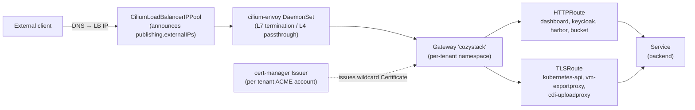
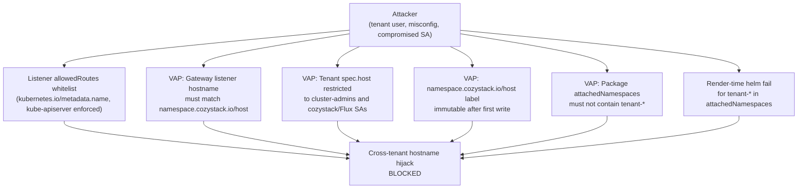

## Overview

Cozystack ships Gateway API support as an opt-in alternative to ingress-nginx. When enabled, every tenant with `spec.gateway: true` gets its own `Gateway` materialised in its own namespace, with the Cilium Gateway API controller programming Envoy-on-DaemonSet and announcing the tenant's LoadBalancer IPs through Cilium LB IPAM. Certificates are issued by cert-manager against a per-tenant `Issuer` so each tenant gets an isolated ACME account.

This page documents the architecture, the two-step opt-in, the security model (four independent ValidatingAdmissionPolicies plus the listener namespace whitelist), and the migration story from ingress-nginx.

Gateway API and ingress-nginx coexist on the same cluster — the two modes are selected per service / per tenant, not globally. Existing clusters upgrade with `gateway.enabled=false` and see no behavioural change.

## Architecture

### Traffic path



- **One `GatewayClass cilium`** cluster-wide, reconciled by Cilium's Gateway API controller. There is no per-tenant GatewayClass, so no tenant can hijack the class by naming theirs after someone else.
- **One `Gateway` per tenant** in the tenant's own namespace. All listeners for that tenant live on a single Gateway object; there is no cross-Gateway merge.
- **Envoy** runs as a Cilium DaemonSet (`cilium.envoy.enabled=true`) and handles both TLS termination (HTTPS listener) and TLS passthrough (dedicated per-service listeners for the kubeapiserver and the KubeVirt VM export / CDI upload proxies).
- **LoadBalancer IP** is assigned by Cilium LB IPAM from a `CiliumLoadBalancerIPPool` scoped to the tenant's `cilium-gateway-cozystack` Service. Tenants with shared apex IPs compete for addresses — operators running multi-tenant bare-metal clusters should either carve up `publishing.externalIPs` or give every tenant its own subset.

### Listener layout on a tenant Gateway

A tenant Gateway always materialises three base listeners:

| # | Name | Protocol | Port | Hostname | Purpose |
|---|---|---|---|---|---|
| 1 | `http` | `HTTP` | 80 | none (wildcard) | ACME `/.well-known/acme-challenge/*` + HTTP→HTTPS redirect HTTPRoute |
| 2 | `https` | `HTTPS` | 443 | `*.<tenant host>` | TLS termination for wildcard subdomain services (dashboard, keycloak, etc.) |
| 3 | `https-apex` | `HTTPS` | 443 | `<tenant host>` | TLS termination for the apex domain itself |

Plus one extra listener per TLS-passthrough service (see [TLS passthrough](#tls-passthrough) below).

`<tenant host>` is read from `_namespace.host` which the tenant chart derives from the tenant's `spec.host` (or inherits from the parent). Listeners 2 and 3 both consume the wildcard `Certificate` that cert-manager issues against the per-tenant `Issuer`.

## Enabling Gateway API

Gateway API is opt-in at two levels. Both defaults stay `false`; upgrades do not flip tenants silently.

### 1. Platform-level flag

Set `gateway.enabled: true` on the `cozystack.cozystack-platform` Package:

```yaml
apiVersion: cozystack.io/v1alpha1
kind: Package
metadata:
  name: cozystack.cozystack-platform
spec:
  variant: isp-full
  components:
    platform:
      values:
        publishing:
          host: example.org
        gateway:
          enabled: true
          attachedNamespaces:
            - cozy-cert-manager
            - cozy-dashboard
            - cozy-keycloak
            - cozy-system
            - cozy-harbor
            - cozy-bucket
            - cozy-kubevirt
            - cozy-kubevirt-cdi
            - cozy-monitoring
            - cozy-linstor-gui
```

Flipping `gateway.enabled=true` wires three things:

- cert-manager `ClusterIssuer.spec.acme.solvers` switches from `http01.ingress.ingressClassName` to `http01.gatewayHTTPRoute` that attaches to the publishing tenant's Gateway.
- The exposed-service templates (dashboard, keycloak) stop rendering their `Ingress` and start rendering their `HTTPRoute`.
- TLS-passthrough services (cozystack-api, vm-exportproxy, cdi-uploadproxy) stop rendering their `Ingress` and start rendering a `TLSRoute` attached to a dedicated Passthrough listener.

The `attachedNamespaces` list restricts which namespaces may attach `HTTPRoute` or `TLSRoute` to tenant Gateways through the listener `allowedRoutes` whitelist (see [Security](#security)). It is also guarded by a runtime `ValidatingAdmissionPolicy` that rejects any `tenant-*` entry.

### 2. Per-tenant toggle

Set `spec.gateway: true` on any tenant to materialise its `Gateway`, `Certificate`, `Issuer` and `CiliumLoadBalancerIPPool`:

```yaml
apiVersion: apps.cozystack.io/v1alpha1
kind: Tenant
metadata:
  name: alice
  namespace: tenant-root
spec:
  gateway: true
  resourceQuotas:
    count/certificates.cert-manager.io: "10"
```

Tenants may leave `spec.host` empty — the tenant chart computes it as `<tenant name>.<parent apex>`. Setting `spec.host` is reserved for cluster-admins and cozystack/Flux service accounts (enforced runtime by `cozystack-tenant-host-policy`, see [Security](#security)).

A child tenant with `spec.gateway: true` receives its own Gateway, its own wildcard Certificate, and its own `Issuer` that talks to Let's Encrypt on a separate ACME account — so child tenants do not share HTTP-01 challenge state with the parent or with siblings.

## Per-service routing

When `gateway.enabled=true`, the following services switch from `Ingress` to Gateway API resources:

### HTTPRoute (TLS termination on Gateway)

| Service | Namespace | `HTTPRoute` name | Backend | Listener |
|---|---|---|---|---|
| dashboard | `cozy-dashboard` | `dashboard` | `incloud-web-gatekeeper:8000` | `https` |
| keycloak | `cozy-keycloak` | `keycloak` | `keycloak-http:80` | `https` |
| harbor | tenant namespace | `<release-name>` | `<release-name>:80` | `https` (tenant's own Gateway) |
| bucket | tenant namespace | `<bucket-name>-ui` | `<bucket-name>-ui:8080` | `https` (tenant's own Gateway) |

cert-manager's HTTP-01 solver places its short-lived `HTTPRoute` on the `http` listener of the same Gateway, path-matched to `/.well-known/acme-challenge/`. More-specific path matching wins over the catch-all HTTP→HTTPS redirect HTTPRoute.

### TLSRoute (TLS passthrough)

Services that need SNI-based passthrough (clients present certificates, backend terminates TLS) use `TLSRoute` on a dedicated Passthrough listener. One listener per service, hostname scoped to that service's FQDN:

| Service | Namespace | `TLSRoute` name | Backend | Listener |
|---|---|---|---|---|
| Kubernetes API | `default` | `kubernetes-api` | `kubernetes:443` | `tls-api` |
| KubeVirt VM export | `cozy-kubevirt` | `vm-exportproxy` | `vm-exportproxy:443` | `tls-vm-exportproxy` |
| KubeVirt CDI upload | `cozy-kubevirt-cdi` | `cdi-uploadproxy` | `cdi-uploadproxy:443` | `tls-cdi-uploadproxy` |

The Passthrough listener is added to the Gateway only if the corresponding service appears in `publishing.exposedServices`. The wildcard `https` listener at `*.<host>` and these specific `tls-*` listeners coexist on port 443 — Cilium resolves SNI to the most-specific hostname match.

`TLSRoute` is shipped from the Gateway API experimental channel (CRD `gateway.networking.k8s.io/v1alpha2`). It graduates to `v1` in Gateway API v1.5 / Cilium v1.20; Cozystack currently pins `v1alpha2` for compatibility with Cilium v1.19.

## Security

Gateway API multi-tenancy in Cozystack is guarded at **four independent ValidatingAdmissionPolicies** plus a listener-level namespace whitelist. Each check enforces one invariant and fails closed on policy/ConfigMap errors (`failurePolicy: Fail`, `validationActions: [Deny]`). Compromising one of them does not bypass the others.



### Layer 1 — Listener `allowedRoutes` namespace whitelist

Every listener on a tenant Gateway pins `allowedRoutes.namespaces.from: Selector` to a `matchExpressions` whitelist against the built-in `kubernetes.io/metadata.name` label. That label is written by kube-apiserver on every namespace and cannot be spoofed.

The whitelist is the publishing tenant's namespace (always, implicit) plus `publishing.gateway.attachedNamespaces`. A namespace outside the list literally cannot attach any `HTTPRoute` to the Gateway.

### Layer 2 — `cozystack-gateway-hostname-policy`

`ValidatingAdmissionPolicy` scoped to `gateway.networking.k8s.io/v1 Gateway` CREATE/UPDATE. CEL reads `namespaceObject.metadata.labels["namespace.cozystack.io/host"]` and rejects any listener whose hostname is not equal to that value or a subdomain of it.

Because the VAP reads the namespace label (not a cluster-wide ConfigMap), a tenant with a fully independent apex domain (e.g. `customer1.io`, not a subdomain of the platform apex) is validated correctly — the VAP does not assume a subdomain hierarchy.

### Layer 3 — `cozystack-tenant-host-policy`

`ValidatingAdmissionPolicy` scoped to `apps.cozystack.io/v1alpha1 Tenant` CREATE/UPDATE. Rejects setting or changing `spec.host` unless the caller is in the `system:masters` group or is a service account in `cozy-*`, `flux-system` or `kube-system`. Tenants can still create tenants with empty `spec.host` (normal inheritance flow).

This closes the path where a tenant user creates a Tenant with `spec.host=dashboard.example.org` to have the tenant chart write a hijacked label into their namespace.

### Layer 4 — `cozystack-namespace-host-label-policy`

`ValidatingAdmissionPolicy` scoped to core `v1 Namespace` UPDATE. Rejects any change to `namespace.cozystack.io/host` once the label is set, except by the same trusted-caller whitelist. CREATE is unrestricted (initial label write happens there, by the cozystack chart).

Combined with Layer 3, a tenant user cannot rewrite their host through either route.

### Layer 5 — `cozystack-gateway-attached-namespaces-policy`

`ValidatingAdmissionPolicy` scoped to `cozystack.io/v1alpha1 Package` CREATE/UPDATE. CEL walks `spec.components.platform.values.gateway.attachedNamespaces` and rejects any entry starting with `tenant-`. Catches `kubectl edit packages.cozystack.io` that would bypass helm.

### Layer 6 — Render-time `fail`

cozystack-basics' hostname policy template also fails the chart render if `_cluster.gateway-attached-namespaces` contains a `tenant-*` entry. Triggers on the helm-install path before the cluster ever sees the values. Belt-and-suspenders with Layer 5.

### What this does NOT defend

These residuals are design choices, not runtime gaps:

- **Cluster-admin credentials.** Anyone in `system:masters` or with a matching cozystack/Flux SA can set any host. Gateway API isolation is not the weakest link at that trust level.
- **DNS control.** A tenant whose VAP-allowed hostname does not resolve to the cluster's LB IP cannot complete ACME HTTP-01. No Certificate is issued; no hijack even if admission somehow admitted the Gateway. ACME's DNS-based identity proof is the last line.
- **Shared LB IP pool.** Tenants drawing from the same `publishing.externalIPs` block compete for addresses via Cilium LB IPAM. Operators with multiple opted-in tenants should carve up the IP space per tenant.

## Certificates

Every tenant with `spec.gateway: true` gets its own cert-manager `Issuer` (namespace-scoped, not `ClusterIssuer`) named `gateway`. The Issuer carries its own ACME account via `privateKeySecretRef: gateway-acme-account`. The wildcard `Certificate` for the tenant references `issuerRef.kind: Issuer, name: gateway`.

Two ACME servers are supported out of the box:

- `publishing.certificates.issuerName: letsencrypt-prod` → `https://acme-v02.api.letsencrypt.org/directory`
- `publishing.certificates.issuerName: letsencrypt-stage` → `https://acme-staging-v02.api.letsencrypt.org/directory`

Any other value fails the chart render with a pointer to `packages/extra/gateway/templates/issuer.yaml` for how to add a new mapping.

### Rate limits

Let's Encrypt enforces per-account and per-registered-domain quotas:

- 50 new certificates per registered domain per week
- 5 duplicate certificates per week for the same hostname set
- 300 new orders per account per 3 hours

A cluster where many tenants share the same apex domain can exhaust these quickly. Mitigations:

- `publishing.certificates.issuerName: letsencrypt-stage` for non-production clusters (staging quotas do not affect prod).
- `tenant.spec.resourceQuotas.count/certificates.cert-manager.io` to cap per-tenant certificate creations.
- For air-gapped deployments, use the bundled `selfsigned-cluster-issuer` or an internal ACME server.

## Migration from ingress-nginx

The two modes coexist. Switching happens per cluster (`gateway.enabled`) and per tenant (`tenant.spec.gateway`), not globally.

### For a new cluster

Set both flags at install time. Ingress-nginx can be disabled entirely:

```yaml
gateway:
  enabled: true
publishing:
  exposure: loadBalancer  # ingress-nginx also moves off Service.spec.externalIPs
```

Tenants then enable `spec.gateway: true` at creation time.

### For an existing cluster

1. Flip `gateway.enabled: true` on the platform Package. This rerenders cert-manager ClusterIssuers and the exposed-service templates. Existing `Ingress` objects for dashboard / keycloak / cozystack-api (Kubernetes API) / vm-exportproxy / cdi-uploadproxy are deleted by Flux as they are replaced by `HTTPRoute` / `TLSRoute`.
2. For each tenant that should move to Gateway API, set `tenant.spec.gateway: true`. The tenant chart materialises the `Gateway`, `Certificate` and `Issuer`.
3. Verify: `kubectl -n <tenant-ns> wait gateway/cozystack --for=condition=Programmed`, then `kubectl -n <tenant-ns> wait certificate/<tenant>-gateway-tls --for=condition=Ready`.
4. Once every tenant has migrated, the `cozystack.ingress-application` package source can be removed from the system bundle — ingress-nginx deployment is no longer required.

Applications that live in upstream vendored charts (harbor, bucket) attach to their tenant's Gateway through `_namespace.gateway`, which the tenant chart populates automatically once `spec.gateway: true` is set.

## Known limitations

- **Tenant IP allocation from a shared pool.** `publishing.externalIPs` is cluster-wide. Tenants with `gateway: true` compete for addresses. Operators running multi-tenant deployments should subset IPs per tenant — Cozystack does not partition the list automatically.
- **TLSRoute v1alpha2.** Gateway API v1.5 / Cilium v1.20 will promote TLSRoute to `v1`. Cozystack will follow once the Cilium version lands. `v1alpha2` is the currently-supported version.
- **`tenant.spec.host` enforcement.** A tenant cannot set their own host (runtime-blocked), but a cluster-admin who misconfigures it will produce a tenant that publishes a hostname they do not own. ACME will fail (no DNS control), so no cert is issued and no hijack materialises, but the diagnostics stop at "Certificate stuck in Pending".
- **Upstream application features.** Some chart-level features in harbor / bucket still rely on ingress-nginx annotations upstream. Cozystack tracks those as upstream PRs; they remain the reason some ops teams will keep ingress-nginx alongside Gateway API for a while.

## Troubleshooting

### Gateway stuck in `Programmed=False`

Check the Cilium Gateway API controller logs:

```bash
kubectl -n cozy-cilium logs deploy/cilium-operator --tail=100 | grep -i gateway
```

Common causes: `gatewayClassName` typo (must be exactly `cilium`), a listener that collides with another listener (same port + protocol + hostname), or an HTTPS listener whose `certificateRefs` points at a Secret that does not exist yet.

### Certificate stuck in `Ready=False`

```bash
kubectl -n <tenant-ns> describe certificate <tenant>-gateway-tls
kubectl -n <tenant-ns> describe challenge
```

If the Challenge's `HTTPRoute` has `Accepted=False`, the HTTP listener's `allowedRoutes` whitelist does not include the Challenge's namespace — expected to be the tenant namespace itself, always implicitly in the list. If the Challenge reports ACME server errors, check DNS: `<host>` and `*.<host>` must resolve to the Gateway's LB IP.

### Admission denied: "Gateway listener hostname must equal..."

The VAP `cozystack-gateway-hostname-policy` rejected the Gateway because a listener hostname does not match `namespace.cozystack.io/host` on the Gateway's namespace. Fix the listener hostname, or (if the namespace label is wrong) update the tenant's `spec.host` via a trusted caller.

### Admission denied: "tenant.spec.host can only be set..."

A non-trusted caller tried to set `tenant.spec.host`. Use an empty `spec.host` (inherit from parent) or have a cluster-admin apply the Tenant.

### Gateway Service `<pending>` LoadBalancer IP

Two causes:

- `publishing.externalIPs` is empty. No `CiliumLoadBalancerIPPool` is rendered.
- Another Gateway (same tenant or another tenant's on the same IP pool) has already claimed the addresses.

`kubectl get ciliumloadbalancerippool` shows the pools, their serviceSelector, and which Service owns each IP.

## See also

- Upstream Gateway API spec: [gateway-api.sigs.k8s.io](https://gateway-api.sigs.k8s.io/)
- Cilium Gateway API documentation: [docs.cilium.io/.../gateway-api](https://docs.cilium.io/en/stable/network/servicemesh/gateway-api/gateway-api/)
- KEP-5707 (`Service.spec.externalIPs` deprecation): [kubernetes/enhancements#5707](https://github.com/kubernetes/enhancements/issues/5707)
- Let's Encrypt rate limits: [letsencrypt.org/docs/rate-limits](https://letsencrypt.org/docs/rate-limits/)
