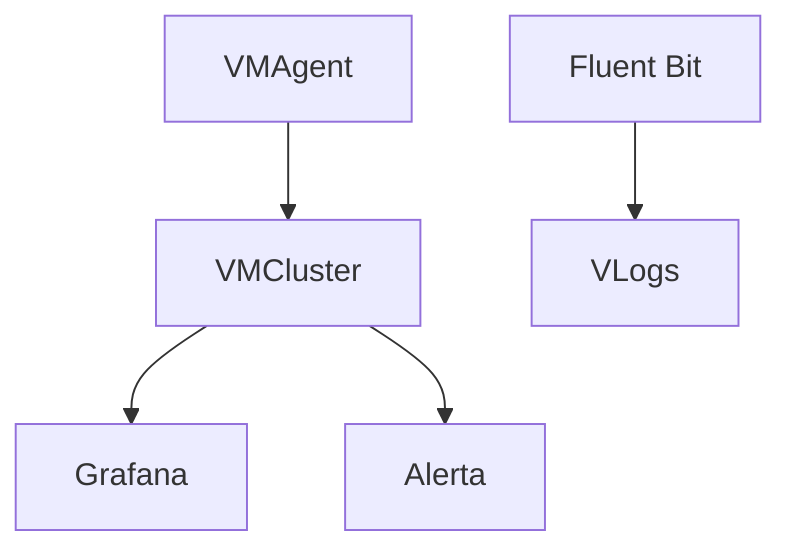
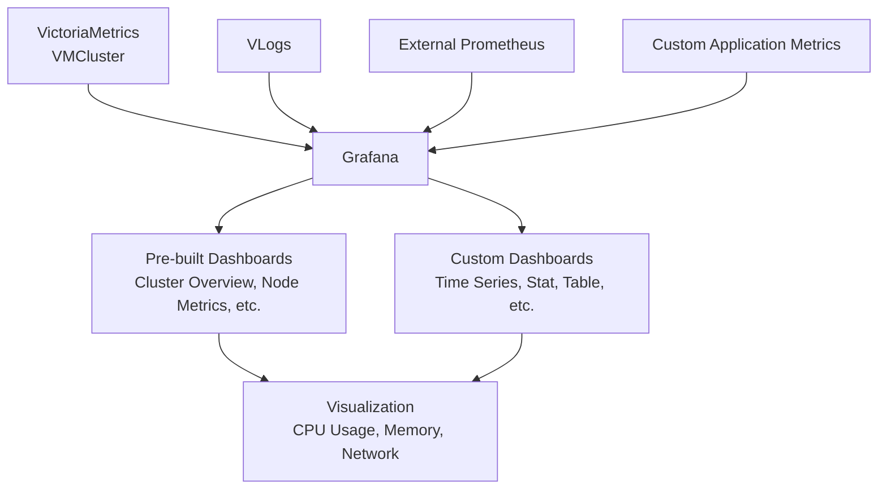
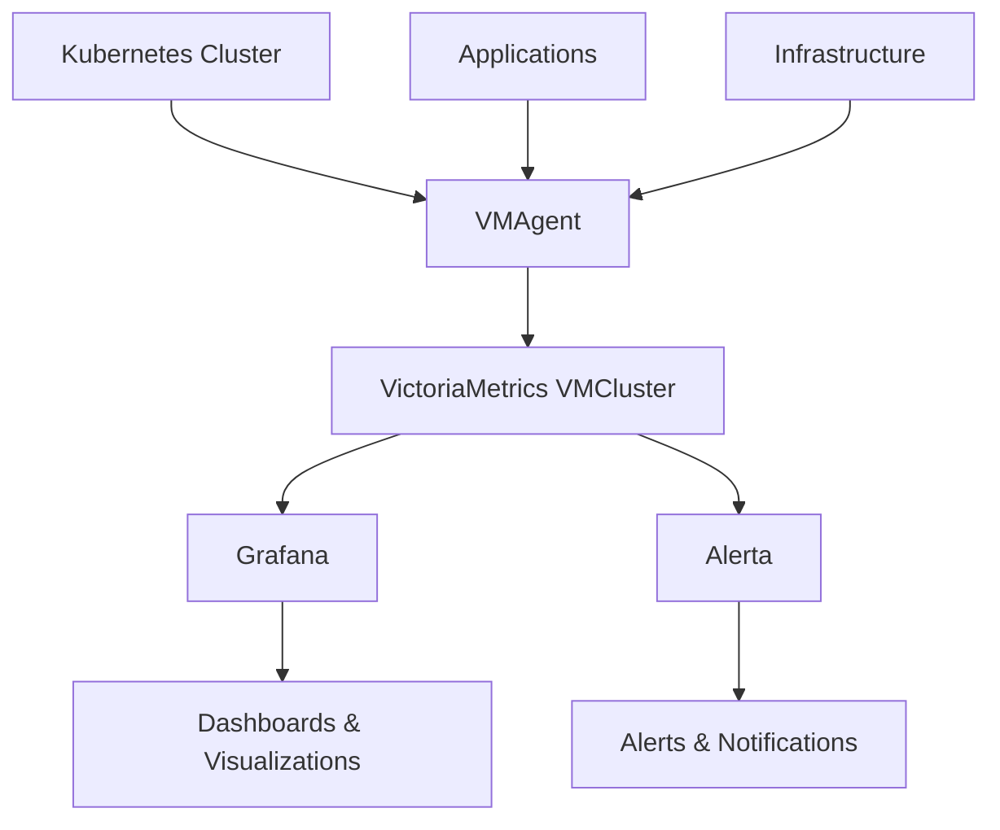
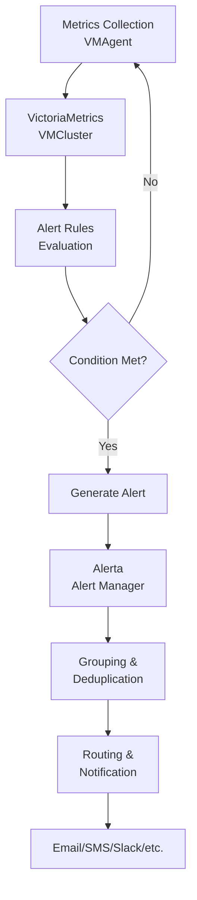
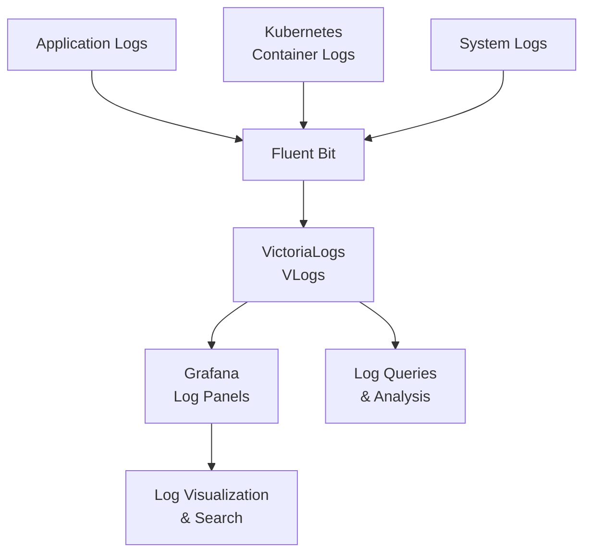

## Data Flow Architecture

## Component Descriptions

- **VMAgent**: A lightweight agent that collects metrics from various sources and sends them to VictoriaMetrics.
- **VMCluster**: A VictoriaMetrics cluster that stores and processes time-series data for efficient querying.
- **Grafana**: An open-source platform for monitoring and observability with customizable dashboards.
- **Alerta**: An alerting system that processes and manages alerts from monitoring systems.
- **Fluent Bit**: A fast and lightweight log processor and forwarder.
- **VLogs**: VictoriaLogs, a high-performance log management system for storing and querying logs.

## Visualization Architecture

### Visualization Component Descriptions

- **VictoriaMetrics VMCluster**: The core metrics storage and querying engine that provides data to Grafana.
- **VLogs**: VictoriaLogs system for log data integration into visualizations.
- **External Prometheus**: Additional metrics sources that can be integrated.
- **Custom Application Metrics**: User-defined metrics from applications.
- **Grafana**: The visualization platform that renders dashboards.
- **Pre-built Dashboards**: Standard dashboards for common monitoring views.
- **Custom Dashboards**: User-created dashboards with various panel types.
- **Visualization**: The final output showing metrics like CPU, memory, and network usage.

## Monitoring Architecture

### Monitoring Architecture Component Descriptions

- **Kubernetes Cluster**: The core platform where workloads run, providing metrics endpoints.
- **Applications**: User applications that expose custom metrics.
- **Infrastructure**: Underlying hardware and system metrics.
- **VMAgent**: Collects metrics from various sources and forwards them to VictoriaMetrics.
- **VictoriaMetrics VMCluster**: Stores and processes time-series metrics data.
- **Grafana**: Provides visualization and dashboarding capabilities.
- **Alerta**: Handles alerting and notification management.
- **Dashboards & Visualizations**: User interfaces for monitoring data.
- **Alerts & Notifications**: System for notifying operators of issues.

## Alerting Flow

### Alerting Flow Component Descriptions

- **Metrics Collection**: Gathering of metrics by VMAgent from sources.
- **VictoriaMetrics VMCluster**: Storage and querying of metrics data.
- **Alert Rules Evaluation**: Checking metrics against predefined thresholds.
- **Generate Alert**: Creating alert instances when conditions are met.
- **Alerta Alert Manager**: Processing and managing alerts.
- **Grouping & Deduplication**: Organizing alerts to avoid duplicates.
- **Routing & Notification**: Directing alerts to appropriate channels.
- **Email/SMS/Slack/etc.**: Final delivery methods for notifications.

## Logging Architecture

### Logging Architecture Component Descriptions

- **Application Logs**: Logs generated by user applications.
- **Kubernetes Container Logs**: Logs from containers running in Kubernetes.
- **System Logs**: Infrastructure and system-level logs.
- **Fluent Bit**: Lightweight log processor that collects and forwards logs.
- **VictoriaLogs VLogs**: High-performance log storage and querying system.
- **Grafana Log Panels**: Integration for visualizing logs in Grafana dashboards.
- **Log Visualization & Search**: Interfaces for exploring and searching log data.
- **Log Queries & Analysis**: Tools for querying and analyzing log information.