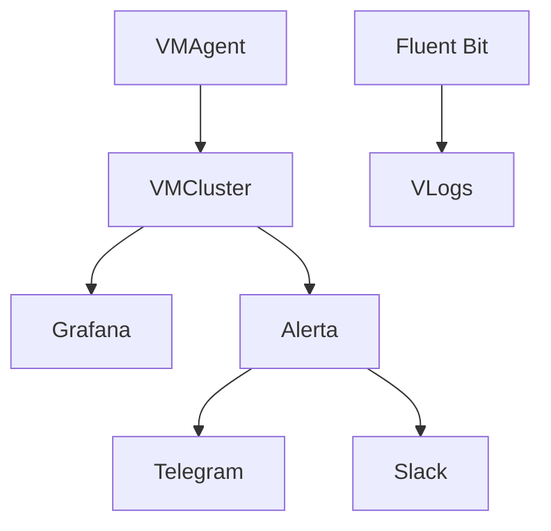
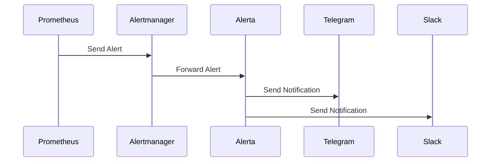



## Monitoring Architecture

```mermaid
graph TD
    A[VMAgent] --> B[VMCluster]
    B --> C[Grafana]
    B --> D[Alerta]
    E[Fluent Bit] --> F[VLogs]
    D --> G[Telegram]
    D --> H[Slack]
```

## Alerting Flow

```mermaid
sequenceDiagram
    participant P as Prometheus
    participant AM as Alertmanager
    participant A as Alerta
    participant T as Telegram
    participant S as Slack
    P->>AM: Send Alert
    AM->>A: Forward Alert
    A->>T: Send Notification
    A->>S: Send Notification
```

