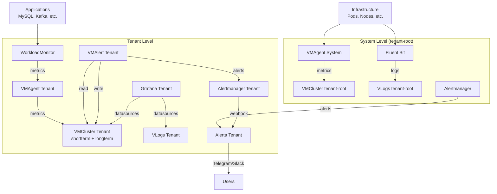

## Overview

Cozystack provides a comprehensive monitoring and alerting system for Kubernetes clusters and applications. The system is based on Victoria Metrics for storing metrics and logs, Grafana for visualization, Alerta for alerting, and WorkloadMonitor for monitoring application states.

The architecture is divided into two levels:

- **System level**: Monitoring of cluster infrastructure
- **Tenant-specific level**: Isolated monitoring for each tenant

## Installation of Monitoring

### System Monitoring

System monitoring is installed automatically during platform deployment through the HelmRelease `monitoring-agents` in `packages/apps/kubernetes/templates/helmreleases/monitoring-agents.yaml`.

To install manually via local chart:

```bash
helm install monitoring-agents ./packages/system/monitoring-agents -n cozy-monitoring --create-namespace
```

### Tenant Monitoring

Monitoring for a specific tenant is activated by patching the Tenant resource (CRD `apps.cozystack.io/v1alpha1/Tenant`).

#### Via Dashboard UI

1. Open the Cozystack dashboard
2. Go to tenant management
3. Select the tenant and set `monitoring: true` in values

#### Programmatically

```bash
kubectl patch tenant <tenant-name> --type merge -p '{"spec":{"values":{"monitoring": true}}}'
```

After activation, FluxCD automatically deploys the HelmRelease `monitoring` in the tenant's namespace from the template `packages/apps/tenant/templates/monitoring.yaml`.

## Component Architecture

### System Level

#### VMAgent
- **Role**: Agent for collecting cluster metrics
- **Configuration**:
  - Scrape interval: 30 seconds
  - External labels: `cluster: cozystack, tenant: tenant-root`
  - Remote write: To VMCluster tenant-root (shortterm and longterm)
- **Metrics sources**:
  - Kubernetes API (Pods, Services, Deployments)
  - kube-state-metrics
  - Node Exporter
  - cAdvisor (via kubelet)

#### VMRule
- **Recording Rules**: Aggregated metrics
  - `container_memory:kmem` - Kernel memory of containers
  - `kube_persistentvolume_is_local` - Local PVs
  - `kube_controller_pod` - Pod connections to controllers
- **Alerting Rules**: Standard Prometheus alerts
  - `TargetDown` - Unavailable targets
  - `Watchdog` - Test alert
  - Kubernetes-specific alerts (apiserver, etcd, nodes, pods)

#### Fluent Bit
- **Role**: Collection and aggregation of logs
- **Inputs**:
  - Container logs: `/var/log/containers/*.log`
  - Kubernetes events
  - Audit logs: `/var/log/audit/kube/*.log`
- **Outputs**: Victoria Logs (`vlogs-generic.tenant-root.svc:9428`)
- **Parsers**: docker, cri, kubernetes metadata

#### Alertmanager
- **Role**: Alert routing
- **Configuration**:
  - Grouping by `alertname`, `namespace`, `cluster`
  - Routes: Alerta webhook, blackhole for `severity="none"`
- **Integration**: Webhook to Alerta for notifications

### Tenant-specific Level

#### Victoria Metrics Cluster
- **Components**:
  - `vminsert`: Metric ingestion (2 replicas)
  - `vmselect`: Metric queries (2 replicas, 2Gi cache)
  - `vmstorage`: Storage (2 replicas, 10Gi PVC)
- **Storage**:
  - Shortterm: 3 days retention, 15s deduplication
  - Longterm: 14 days retention, 5m deduplication
  - Replication: Factor 2

#### Victoria Logs
- **Role**: Storage of structured logs
- **Configuration**: 1 year retention, 10Gi PVC

#### Grafana
- **Role**: Visualization of metrics and logs
- **Database**: PostgreSQL (10Gi PVC)
- **Datasources**:
  - Victoria Metrics (metrics)
  - Victoria Logs (logs)
- **Ingress**: `grafana.{tenant-host}`
- **Resources**: 2 replicas, limits 1 CPU/1Gi RAM
- **Dashboards**: Pre-configured for all Cozystack components

#### Alerta
- **Role**: Centralized alerting
- **Database**: PostgreSQL (10Gi PVC)
- **Notifications**: Telegram, Slack
- **API**: Protected by API key
- **Ingress**: `alerta.{tenant-host}`

#### VMAlert (tenant)
- **Role**: Alert evaluation for tenant
- **Datasource**: vmselect shortterm
- **Remote write**: Back to vminsert shortterm
- **Evaluation interval**: 15 seconds

#### VMAgent (tenant)
- **Role**: Collection of metrics from tenant namespace
- **Selector**: `namespace.cozystack.io/monitoring`
- **External labels**: `cluster: cozystack, tenant: {namespace}`
- **Remote write**: vminsert shortterm and longterm

## Application Monitoring

### WorkloadMonitor CRD

WorkloadMonitor (`cozystack.io/v1alpha1/WorkloadMonitor`) is primarily used for billing, tracking workload states, and collecting resource metrics. Alerting is an additional function.

#### Specification

```yaml
apiVersion: cozystack.io/v1alpha1
kind: WorkloadMonitor
metadata:
  name: mysql-instance
spec:
  replicas: 1
  minReplicas: 1
  kind: mysql
  type: mysql
  selector:
    app.kubernetes.io/instance: mysql-instance
  version: "10.11"
```

#### Status

```yaml
status:
  operational: true  # true if AvailableReplicas >= MinReplicas
  availableReplicas: 1
  observedReplicas: 1
```

### WorkloadMonitor Controller

- Tracks Pods, PVCs, Services by selector
- Creates CRD Workload with aggregated metrics for billing
- Exports metrics via kube-state-metrics

### Alerting Integration

Although WorkloadMonitor is intended for billing, it also integrates with alerting. An alert triggers on `cozy_workload_status_operational{operational="false"} == 1`:

1. VMAlert evaluates the rule
2. Sends alert to Alertmanager
3. Alertmanager routes to Alerta
4. Alerta sends notifications (Telegram/Slack)

### Examples for Applications

#### MySQL

```yaml
apiVersion: cozystack.io/v1alpha1
kind: WorkloadMonitor
metadata:
  name: {{ .Release.Name }}
spec:
  replicas: {{ .Values.replicas }}
  minReplicas: 1
  kind: mysql
  type: mysql
  selector:
    app.kubernetes.io/instance: {{ .Release.Name }}
  version: {{ .Chart.Version }}
```

#### Kafka

For Kafka:

```yaml
apiVersion: cozystack.io/v1alpha1
kind: WorkloadMonitor
metadata:
  name: {{ .Release.Name }}-kafka
spec:
  replicas: {{ .Values.kafka.replicas }}
  minReplicas: 1
  kind: kafka
  type: kafka
  selector:
    app.kubernetes.io/name: kafka
    app.kubernetes.io/instance: {{ .Release.Name }}
  version: {{ .Chart.Version }}
```

For Zookeeper:

```yaml
apiVersion: cozystack.io/v1alpha1
kind: WorkloadMonitor
metadata:
  name: {{ .Release.Name }}-zookeeper
spec:
  replicas: {{ .Values.zookeeper.replicas }}
  minReplicas: 1
  kind: zookeeper
  type: zookeeper
  selector:
    app.kubernetes.io/name: zookeeper
    app.kubernetes.io/instance: {{ .Release.Name }}
  version: {{ .Chart.Version }}
```

Similar configurations apply for PostgreSQL, Redis, ClickHouse, RabbitMQ, NATS, and other applications.

## Data Flow



## Configuration and Setup

### values.yaml Parameters

#### System Monitoring (`packages/system/monitoring-agents/values.yaml`)

```yaml
# VMAgent
vmagent:
  shardCount: 1
  externalLabels:
    cluster: cozystack
    tenant: tenant-root
  remoteWrite:
    - url: "http://vminsert-shortterm.tenant-root.svc:8480/insert/0/prometheus"
    - url: "http://vminsert-longterm.tenant-root.svc:8480/insert/0/prometheus"

# Fluent Bit
fluent-bit:
  inputs:
    - tail:
        path: /var/log/containers/*.log
    - kubernetes_events:
        kube_url: https://kubernetes.default.svc:443
  outputs:
    - vlogs:
        url: http://vlogs-generic.tenant-root.svc:9428
```

#### Tenant Monitoring (`packages/extra/monitoring/values.yaml`)

```yaml
# VMCluster
metricsStorages:
  shortterm:
    retention: "3d"
    deduplication: "15s"
  longterm:
    retention: "14d"
    deduplication: "5m"

# Grafana
grafana:
  host: grafana.example.com
  resources:
    limits:
      cpu: 1
      memory: 1Gi

# Alerta
alerta:
  host: alerta.example.com
  telegram:
    token: "your-telegram-token"
  slack:
    webhook: "your-slack-webhook"
```

### Grafana Dashboards

Cozystack includes pre-configured dashboards for:

- **Kubernetes**: nodes, pods, control-plane
- **Victoria Metrics**: cluster, agent, alert
- **Applications**: nginx, postgres, redis, kafka, mysql, etc.
- **Flux**: control-plane, stats
- **Storage**: linstor, seaweedfs

Dashboards are defined in `packages/extra/monitoring/dashboards.list`.

To access Grafana:

1. Navigate to `https://grafana.{tenant-host}`
2. Log in with default credentials (admin/admin) or configured ones
3. Explore pre-configured dashboards in the Dashboards section

## Security and Scalability

### Security

- **RBAC**: Minimal rights for service accounts
- **Network Policies**: Traffic restriction between components
- **TLS**: Ingress with TLS certificates
- **API Keys**: Authentication for Alerta

### Scalability

- **Horizontal Pod Autoscaling**: For VM components
- **Resource Limits**: Configurable CPU/Memory
- **Storage**: PVC with configurable storageClass
- **Sharding**: VMAgent supports load distribution

## Integrations

- **Alertmanager**: Webhook, email, PagerDuty, Slack
- **Grafana**: Plugins for Victoria Metrics, Loki
- **External Storage**: Remote write to external VM instances
- **GitOps**: Management via FluxCD

## Diagnostics and Troubleshooting

### Status Checks

To verify the monitoring setup:

```bash
# Check VMCluster status
kubectl get vmcluster -n <tenant-namespace>

# Check VMAgent pods
kubectl get pods -n cozy-monitoring -l app.kubernetes.io/name=vmagent

# Check Grafana pods
kubectl get pods -n <tenant-namespace> -l app.kubernetes.io/name=grafana

# Check Alerta pods
kubectl get pods -n <tenant-namespace> -l app.kubernetes.io/name=alerta

# Check WorkloadMonitor status
kubectl get workloadmonitor -n <tenant-namespace>
```

### Viewing Logs

```bash
# VMAgent logs
kubectl logs -n cozy-monitoring deployment/vmagent

# VMAlert logs
kubectl logs -n <tenant-namespace> deployment/vmalert

# Fluent Bit logs
kubectl logs -n cozy-monitoring daemonset/fluent-bit

# Grafana logs
kubectl logs -n <tenant-namespace> deployment/grafana
```

### Common Issues

- **Metrics not being collected**: Check selectors in VMServiceScrape resources
- **Alerts not triggering**: Verify rules in VMRule resources and Alertmanager configuration
- **Logs not arriving**: Inspect Fluent Bit configuration and outputs
- **WorkloadMonitor not working**: Check selector labels and CRD status
- **Grafana not accessible**: Verify ingress configuration and TLS certificates
- **Alerta notifications failing**: Check API keys and webhook URLs

### Additional Troubleshooting Commands

```bash
# Check VMCluster health
kubectl describe vmcluster -n <tenant-namespace>

# List active alerts
kubectl get prometheusrules -n <tenant-namespace>

# Check network policies
kubectl get networkpolicies -n <tenant-namespace>

# Verify RBAC permissions
kubectl auth can-i get pods --as=system:serviceaccount:<namespace>:<serviceaccount>
```

This documentation covers all aspects of monitoring and alerting in Cozystack based on analysis of the real project code.