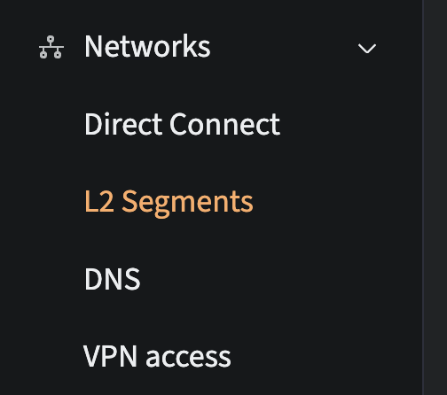
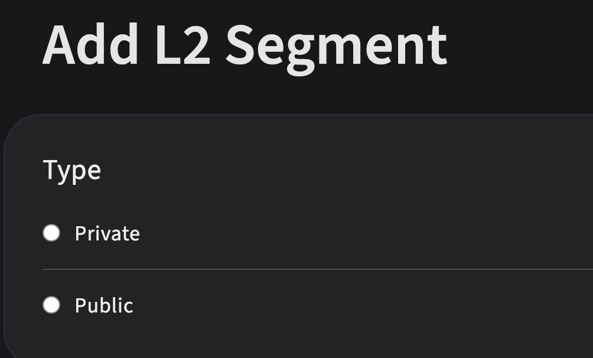
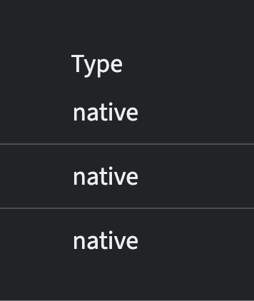
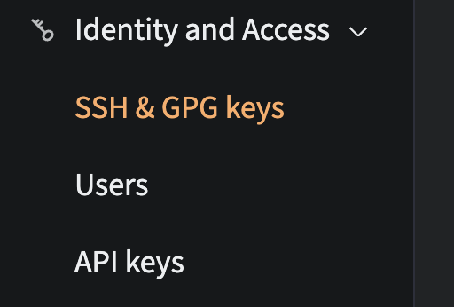
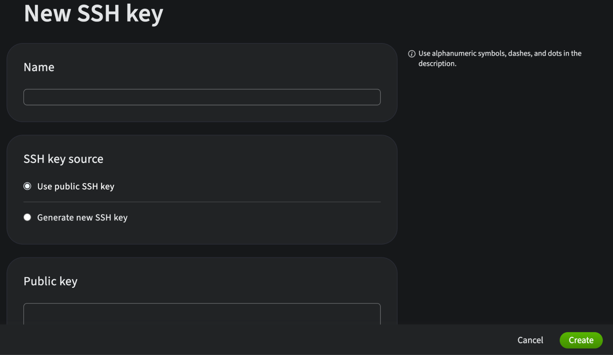

## Before Installation

### 1. Network

1.  **Remove Aggregate Interface**

    1.  Go to **Dedicated Server > Server Details**, and click the second column (highlighted in blue) to remove the aggregate interface.

    1.  Ensure the status appears as shown in the screenshot.

        

1.  **Set Up L2 Network**

    1.  Navigate to **Networks > L2 Segment** and click **Add Segment**.

        

        

        

        First, select **Private**, choose the region, add the servers, assign a name, and save it.

    1.  Set the type to **Native**. 
        Do the same for **Public**.

        

### 2. Access

1.  Create SSH keys for server access.

1.  Go to **Identity and Access > SSH and Keys**.

    

1.  Create new keys or add your own.

    
    

## Setup OS

### 1. Rescue Mode / Access

1.  Go to **Dedicated Servers > Server Details**, and click **Reboot to Rescue**. Select your SSH key.

    

1.  Connect via SSH. Log in via SSH using the external IP of the server (**Details** > **Public IP** ).

    

### 2. Setup

1.  Check the information on block devices:

    ```console
    # lsblk
    NAME    MAJ:MIN   RM   SIZE     RO   TYPE   MOUNTPOINTS
    sda     259:4     0    476.9G   0    disk
    sdb     259:0     0    476.9G   0    disk
    ```

1.  Wipe disks.

    {}
    :warning: The following commands will erase your data!
    {}

    ```bash
    wipefs -a /dev/sda
    wipefs -a /dev/sdb
    ```

1.  Install `kexec-tools`:

    ```bash
    dnf install kexec-tools -y
    ```

1.  Download kernel and initramfs:

    ```bash
    wget -O /tmp/vmlinuz https://github.com/cozystack/cozystack/releases/latest/download/kernel-amd64
    wget -O /tmp/initramfs.xz https://github.com/cozystack/cozystack/releases/latest/download/initramfs-metal-amd64.xz
    ```

1.  Set environment variables:

    ```bash
    INTERFACE=$(ip -o link show | grep 'master bond0' | grep -m1 'state UP' | awk -F': ' '{print $2}')
    INTERFACE_NAME=$(udevadm info -q property "/sys/class/net/$INTERFACE" | grep "ID_NET_NAME_ONBOARD=" | cut -d'=' -f2)
    IP_CIDR=$(ip addr show bond0 | grep "inet\b" | awk '{print $2}')
    IP=$(echo $IP_CIDR | cut -d/ -f1)
    NETMASK=$(ipcalc -m $IP_CIDR | cut -d= -f2-)
    GATEWAY=$(ip route | grep default | awk '{print $3}')
    ```

1.  Set `CMDLINE`, and echo it to verify:

    ```bash
    CMDLINE="init_on_alloc=1 slab_nomerge pti=on console=tty0 console=ttyS0 printk.devkmsg=on talos.platform=metal ip=${IP}::${GATEWAY}:${NETMASK}::${INTERFACE_NAME}:::::"
    echo $CMDLINE
    ```

### 3. Boot into Talos

1.  Load the kernel and initramfs:

    ```bash
    kexec -l /tmp/vmlinuz --initrd=/tmp/initramfs.xz --command-line="$CMDLINE"
    ```

1.  Boot into the new kernel:

    ```bash
    kexec -e
    ```

After executing the command, the system will reboot into the new kernel.
Your SSH session will stop responding, and the server will reboot.

Wait for around 5 minutes for the system to boot.

## Talos Configuration

Use [Talm](https://github.com/cozystack/talm) to apply config and install Talos Linux on the drive.

1. [Download the latest Talm binary](https://github.com/cozystack/talm/releases/latest) and save it to `/usr/local/bin/talm`

1. Make it executable:

   ```bash
   chmod +x /usr/local/bin/talm
   ```

### Installation with Talm

1. Create directory for the new cluster:

   ```bash
   mkdir -p mycluster
   cd mycluster
   ```

1. Run the following command to initialize Talm for Cozystack:

   ```bash
   talm init -p cozystack
   ```

   After initializing, generate a configuration template with the command:

   ```bash
   talm -n 1.2.3.4 -e 1.2.3.4 template -t templates/controlplane.yaml -i > nodes/nodeN.yaml
   ```

1. Edit the node configuration file as needed.

   1.  Update `hostname` to the desired name.
       ```yaml
       machine:
         network:
           hostname: node1
       ```

   1.  Update `nameservers` to the public ones, because internal servers.com DNS is not reachable from the private network.
       ```yaml
       machine:
         network:
           nameservers:
             - 8.8.8.8
             - 1.1.1.1
       ```

   1.  Add private interface configuration, and move `vip` to this section. This section isn’t generated automatically:
       -   `busPath` - Obtained from the "Discovered interfaces busPath" by matching the MAC address of the private interface specified in the provider's email.
           (Out of the two interfaces, select the one with the uplink).
       -   `addresses` - Use the address specified for Layer 2 (L2).

       Example:
       ```yaml
       matching:
         network:
           interfaces:
             - deviceSelector:
                 busPath: "0000:03:00.1"
               addresses:
                 - 1.2.3.4/29
               routes:
                 - network: 0.0.0.0/0
                   gateway: 1.2.3.1
             - deviceSelector:
                 busPath: "0000:03:00.0"
               addresses:
                 - 192.168.100.11/24
               vip:
                 ip: 192.168.100.10
       ```

**Execution steps:**

1.   Run `talm apply -f nodeN.yml` for all nodes to apply the configurations. The nodes will be rebooted and Talos will be installed on the disk.

1.   Make sure that talos get installed into disk by executing `talm get systemdisk -f nodeN.yml` for each node. The output should be similar to:
     ```yaml
     NODE      NAMESPACE   TYPE         ID            VERSION   DISK
     1.2.3.4   runtime     SystemDisk   system-disk   1         sda
     ```                                                           

     If the output is empty, it means that Talos still runs in RAM and hasn't been installed on the disk yet.
1.   Click **Exit rescue mode** for each node in the Servers.com panel. The nodes will reboot again.

1.   Execute bootstrap command for the first node in the cluster, example:
     ```bash
     talm bootstrap -f nodes/node1.yml
     ```            

1.   Get `kubeconfig` from the first node, example:
     ```bash
     talm kubeconfig kubeconfig -f nodes/node1.yml
     ```                          

1.   Edit `kubeconfig` to set the IP address to one of control-plane node, example:
     ```yaml
     server: https://1.2.3.4:6443
     ```                    

1.   Export variable to use the kubeconfig, and check the connection to the Kubernetes:
     ```bash
     export KUBECONFIG=${PWD}/kubeconfig
     kubectl get nodes
     ```

Now follow **Get Started** guide starting from the [**Install Cozystack**](/docs/getting-started/first-deployment/#install-cozystack) section, to continue the installation.
