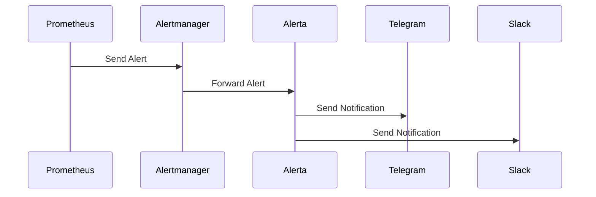

## Overview

The alerting system in Cozystack integrates Prometheus, Alertmanager, and Alerta to provide comprehensive monitoring and notification capabilities. Alerts are generated based on metrics collected by VMAgent and stored in VMCluster, then routed through Alertmanager for grouping and deduplication, and finally managed by Alerta for notifications via various channels like Telegram and Slack.

### Alerting Flow



## Configuring Alerts in Alerta

Alerta is the alerting system integrated into Cozystack's monitoring stack. It processes alerts from various sources and provides notifications through multiple channels.

### Alert Rules

Alerts are generated based on Prometheus rules defined in the monitoring configuration. You can configure custom alert rules by modifying the PrometheusRule resources in your tenant's namespace.

To create custom alerts, define PrometheusRule manifests with expressions that evaluate to true when the alert condition is met. Each rule includes:

- **expr**: The PromQL expression to evaluate.
- **for**: Duration the condition must be true before firing the alert.
- **labels**: Metadata like severity.
- **annotations**: Descriptive information for notifications.

Example of a custom alert rule:

```yaml
apiVersion: monitoring.coreos.com/v1
kind: PrometheusRule
metadata:
  name: custom-alerts
  namespace: tenant-name
spec:
  groups:
  - name: custom.rules
    rules:
    - alert: HighCPUUsage
      expr: (1 - avg(rate(node_cpu_seconds_total{mode="idle"}[5m]))) * 100 > 80
      for: 5m
      labels:
        severity: warning
      annotations:
        summary: "High CPU usage detected"
        description: "CPU usage is above 80% for more than 5 minutes"
```

### Severity Levels

Alerta supports the following severity levels:

- **informational**: Low-priority information
- **warning**: Potential issues that require attention
- **critical**: Urgent issues that need immediate action
- **major**: Significant problems affecting operations
- **minor**: Minor issues

You can configure which severities trigger notifications in the Alerta configuration.

### Integrations

#### Telegram Integration

To enable Telegram notifications, configure the following in your monitoring settings:

```yaml
alerta:
  alerts:
    telegram:
      token: "your-telegram-bot-token"
      chatID: "chat-id-1,chat-id-2"
      disabledSeverity:
        - informational
```

#### Slack Integration

For Slack notifications:

```yaml
alerta:
  alerts:
    slack:
      url: "https://hooks.slack.com/services/YOUR/SLACK/WEBHOOK"
      disabledSeverity:
        - informational
        - warning
```

#### Email Integration

To enable email notifications:

```yaml
alerta:
  alerts:
    email:
      smtpHost: "smtp.example.com"
      smtpPort: 587
      smtpUser: "alerts@example.com"
      smtpPassword: "your-password"
      fromAddress: "alerts@example.com"
      toAddress: "team@example.com"
      disabledSeverity: 
        - informational
```

#### PagerDuty Integration

For PagerDuty notifications:

```yaml
alerta:
  alerts:
    pagerduty:
      serviceKey: "YOUR_PAGERDUTY_INTEGRATION_KEY"
      disabledSeverity:
        - informational
        - warning
```

For detailed configuration options, see [Monitoring Hub Reference]({}).

## Alert Examples

Here are common alert examples for system monitoring:

### CPU Usage Alert

```yaml
- alert: HighCPUUsage
  expr: 100 - (avg by(instance) (irate(node_cpu_seconds_total{mode="idle"}[5m])) * 100) > 80
  for: 5m
  labels:
    severity: warning
  annotations:
    summary: "High CPU usage on {{ $labels.instance }}"
    description: "CPU usage is {{ $value }}% for more than 5 minutes"
```

### Memory Usage Alert

```yaml
- alert: HighMemoryUsage
  expr: (1 - node_memory_MemAvailable_bytes / node_memory_MemTotal_bytes) * 100 > 90
  for: 5m
  labels:
    severity: critical
  annotations:
    summary: "High memory usage on {{ $labels.instance }}"
    description: "Memory usage is {{ $value }}% for more than 5 minutes"
```

### Disk Space Alert

```yaml
- alert: LowDiskSpace
  expr: (node_filesystem_avail_bytes / node_filesystem_size_bytes) * 100 < 10
  for: 5m
  labels:
    severity: critical
  annotations:
    summary: "Low disk space on {{ $labels.instance }}"
    description: "Disk space available is {{ $value }}% for more than 5 minutes"
```

### WorkloadNotOperational Alert

```yaml
- alert: WorkloadNotOperational
  expr: up{job="workload-monitor"} == 0
  for: 1m
  labels:
    severity: critical
  annotations:
    summary: "Workload {{ $labels.workload }} is not operational"
    description: "Workload monitor reports the workload is down"
```

### Network Interface Down Alert

```yaml
- alert: NetworkInterfaceDown
  expr: node_network_up{device!~"lo"} == 0
  for: 2m
  labels:
    severity: critical
  annotations:
    summary: "Network interface {{ $labels.device }} is down on {{ $labels.instance }}"
    description: "Network interface has been down for more than 2 minutes"
```

### Kubernetes Pod Crash Alert

```yaml
- alert: KubernetesPodCrashLooping
  expr: rate(kube_pod_container_status_restarts_total[10m]) > 0.5
  for: 5m
  labels:
    severity: warning
  annotations:
    summary: "Pod {{ $labels.pod }} is crash looping"
    description: "Pod is restarting more than once every 2 minutes"
```

### High Network Latency Alert

```yaml
- alert: HighNetworkLatency
  expr: node_network_receive_bytes_total / node_network_receive_packets_total > 1500
  for: 5m
  labels:
    severity: warning
  annotations:
    summary: "High network latency on {{ $labels.instance }}"
    description: "Average packet size exceeds 1500 bytes, indicating potential latency issues"
```

## Managing Alerts

### Escalation

Alerts can be escalated based on duration and severity. Configure escalation policies in Alerta to automatically increase severity or notify additional channels if an alert remains unresolved.

Escalation helps ensure that critical issues are addressed promptly. You can define escalation rules based on:

- Time thresholds (e.g., escalate after 15 minutes)
- Severity levels
- Alert attributes (e.g., specific services or environments)

Example escalation configuration:

- Warning alerts escalate to critical after 30 minutes
- Critical alerts trigger immediate notifications to on-call personnel
- Major alerts notify management after 1 hour

To configure escalation in Alerta, use the web interface or API to set up escalation policies for different alert types.

### Suppression

You can suppress alerts temporarily using Alerta's silencing feature. This is useful during maintenance windows, planned outages, or when investigating known issues without triggering notifications.

Silences can be created for specific alerts or based on filters like environment, resource, or event type. Silenced alerts are still visible in the Alerta dashboard but do not generate notifications.

To create a silence:

1. Go to the Alerta web interface
2. Navigate to the Alerts section
3. Select the alert to silence or use filters to silence multiple alerts
4. Choose "Silence" and set the duration and reason

Alternatively, use the API:

```bash
curl -X POST https://alerta.example.com/api/v2/silences \
  -H "Authorization: Bearer YOUR_API_KEY" \
  -H "Content-Type: application/json" \
  -d '{
    "environment": "production",
    "resource": "server-01",
    "event": "HighCPUUsage",
    "startTime": "2023-12-01T00:00:00Z",
    "duration": 3600,
    "comment": "Scheduled maintenance"
  }'
```

Silences can also be managed via Alertmanager for more advanced routing-based suppression.

## Alertmanager Configuration

Alertmanager handles routing, grouping, and deduplication of alerts before sending notifications. It acts as an intermediary between Prometheus and notification systems like Alerta.

### Grouping

Alerts can be grouped by labels to reduce noise and prevent alert fatigue. Configure grouping in the Alertmanager configuration:

```yaml
route:
  group_by: ['alertname', 'cluster', 'namespace']
  group_wait: 10s
  group_interval: 10s
  repeat_interval: 1h
  receiver: 'default'
```

- **group_by**: Labels to group alerts by
- **group_wait**: Time to wait before sending the first notification
- **group_interval**: Interval between notifications for the same group
- **repeat_interval**: Minimum time between notifications

### Routing

Route alerts to different receivers based on labels, allowing for targeted notifications:

```yaml
route:
  receiver: 'default'
  routes:
  - match:
      severity: critical
    receiver: 'critical-alerts'
  - match:
      team: devops
    receiver: 'devops-team'
  - match_re:
      namespace: 'kube-.*'
    receiver: 'kubernetes-alerts'

receivers:
- name: 'default'
  slack_configs:
  - api_url: 'https://hooks.slack.com/services/YOUR/SLACK/WEBHOOK'
    channel: '#alerts'
- name: 'critical-alerts'
  pagerduty_configs:
  - service_key: 'YOUR_PAGERDUTY_KEY'
- name: 'devops-team'
  email_configs:
  - to: 'devops@example.com'
    from: 'alertmanager@example.com'
    smarthost: 'smtp.example.com:587'
    auth_username: 'alertmanager@example.com'
    auth_password: 'password'
- name: 'kubernetes-alerts'
  webhook_configs:
  - url: 'http://alerta.example.com/api/webhooks/prometheus'
    send_resolved: true
```

### Inhibition

Use inhibition rules to suppress certain alerts when other related alerts are firing:

```yaml
inhibit_rules:
- source_match:
    alertname: 'NodeDown'
  target_match:
    alertname: 'PodCrashLooping'
  equal: ['node']
```

For more information on Alertmanager configuration, refer to the [official documentation](https://prometheus.io/docs/alerting/latest/alertmanager/).