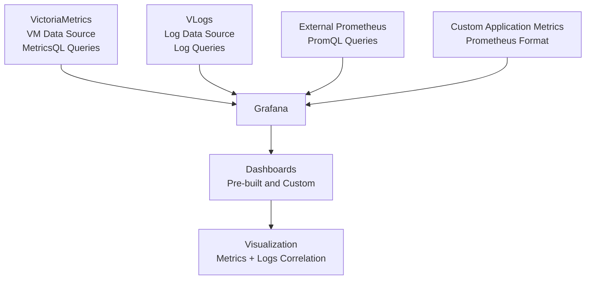

## Overview

Cozystack integrates Grafana as the primary visualization tool for monitoring metrics collected by VictoriaMetrics (VM). This section covers accessing pre-built dashboards, creating custom visualizations, and integrating external data sources to provide comprehensive observability for your Cozystack clusters and applications.

## Accessing Grafana

To access Grafana and explore dashboards:

1. Navigate to the Grafana URL: `https://grafana.<tenant-domain>`, where `<tenant-domain>` is your tenant's domain.
2. Log in using your tenant credentials (OIDC or token-based authentication).
3. Once logged in, you can browse pre-configured dashboards in the "Dashboards" section.

For initial setup and configuration details, refer to [Monitoring Setup]({{{}).

## Pre-built Dashboards

Cozystack provides a set of pre-configured dashboards in Grafana, automatically deployed and updated via the monitoring stack. These dashboards are defined in the `packages/extra/monitoring/dashboards.list` file and offer out-of-the-box insights into system and application performance.

### Cluster Infrastructure Dashboards

- **Kubernetes Cluster Overview**: Provides a high-level view of the entire Kubernetes cluster, including node status, pod health, cluster-wide CPU/memory/disk utilization, and API server performance. Useful for quick health checks and identifying resource bottlenecks across the cluster.
- **Node Metrics**: Detailed per-node metrics such as CPU usage, memory consumption, disk I/O, network traffic, and system load. Includes panels for individual nodes and aggregated views. Ideal for diagnosing node-specific issues.
- **ETCD Metrics**: Monitors ETCD cluster health, including latency, storage usage, leader elections, and database operations. Essential for ensuring the reliability of Kubernetes control plane data.
- **Storage Metrics**: Insights into storage components like Linstor and SeaweedFS, covering volume usage, I/O operations, replication status, and performance metrics. Helps in managing storage resources and troubleshooting storage-related problems.

### Application and Service Dashboards

- **Tenant Applications**: Customizable dashboards for user-deployed applications, displaying metrics such as request rates, error rates, response times, and throughput. Supports applications like web services, APIs, and microservices running in tenant namespaces.
- **Service Mesh**: Metrics for networking components, including ingress controllers (e.g., NGINX, Traefik), load balancers, and service mesh proxies. Covers traffic patterns, latency, error rates, and connectivity health.
- **Database Metrics**: Specialized dashboards for supported databases such as PostgreSQL, MySQL, Redis, and others. Includes query performance, connection counts, cache hit rates, and storage metrics. For example, the PostgreSQL dashboard shows active connections, slow queries, and replication status.

These dashboards are regularly updated with new releases. For screenshots and visual examples, check the [Cozystack blog](https://cozystack.io/blog/) for release notes featuring dashboard previews.

## Creating Custom Dashboards

If the pre-built dashboards do not meet your needs, you can create custom dashboards in Grafana to visualize specific metrics or combine data from multiple sources.

### Steps to Create a Custom Dashboard

1. **Access Grafana**: Log in to Grafana using your tenant credentials.
2. **Create a New Dashboard**: Click the "+" icon in the sidebar and select "Dashboard".
3. **Add Panels**: Click "Add new panel" to create visualizations. Choose from various panel types and configure data sources.
4. **Configure Queries**: Use MetricsQL (VictoriaMetrics query language) to fetch and transform data.
5. **Customize Layout**: Arrange panels, set time ranges, and add annotations or variables for interactivity.
6. **Save and Share**: Save the dashboard, set permissions, and optionally export it for reuse.


### Example Queries

Here are some common MetricsQL queries for custom panels:

- **Pod CPU Usage**:
  ```promql
  rate(container_cpu_usage_seconds_total{pod=~"$pod"}[5m])
  ```
  Displays CPU usage rate for selected pods over time.

- **Memory Usage Percentage**:
  ```promql
  (1 - node_memory_MemAvailable_bytes / node_memory_MemTotal_bytes) * 100
  ```
  Shows memory utilization as a percentage for nodes.

- **Network Traffic**:
  ```promql
  rate(node_network_receive_bytes_total[5m]) + rate(node_network_transmit_bytes_total[5m])
  ```
  Monitors incoming and outgoing network traffic.

- **Application Response Time**:
  ```promql
  histogram_quantile(0.95, rate(http_request_duration_seconds_bucket{job="my-app"}[5m]))
  ```
  Calculates the 95th percentile response time for an application.

### Panel Types and Best Practices

- **Time Series (Graph)**: Ideal for trends over time, such as CPU usage or request rates. Use for historical data visualization.
- **Stat**: Displays single values, like current CPU percentage or total requests. Good for at-a-glance metrics.
- **Table**: Shows tabular data, such as top processes or alert summaries. Useful for detailed listings.
- **Heatmap**: Visualizes density, like error rates across time intervals. Effective for spotting patterns.
- **Gauge**: Represents values on a scale, such as disk usage percentage.

When creating panels, consider:
- Use appropriate time ranges and refresh intervals.
- Add thresholds and alerts directly in panels for proactive monitoring.
- Leverage variables for dynamic filtering (e.g., by namespace or pod name).

For advanced querying and functions, refer to the [VictoriaMetrics MetricsQL documentation](https://docs.victoriametrics.com/MetricsQL.html).

## Integrating External Data Sources

Cozystack allows integration with external monitoring systems to centralize observability.

### Adding External Prometheus

To integrate an external Prometheus instance:

1. In Grafana, go to "Configuration" > "Data Sources" > "Add data source".
2. Select "Prometheus" as the type.
3. Enter the external Prometheus URL, authentication details (if required), and scrape interval.
4. Test the connection and save.
5. Use PromQL in your dashboards to query the external data.

### Custom Application Metrics

For applications exposing custom metrics:

- Ensure your application exposes metrics in Prometheus format (e.g., via `/metrics` endpoint).
- Configure VMAgent in Cozystack to scrape these endpoints by updating the monitoring configuration.
- Metrics will be ingested into VM and available for querying in Grafana.

Follow Prometheus [metric naming conventions](https://prometheus.io/docs/practices/naming/) to ensure compatibility. For configuration examples, see [Monitoring Hub Reference]({{{}).

### Grafana Data Sources Integration

This diagram shows how external data sources are integrated into Grafana for centralized monitoring.



## Data Sources Configuration

Grafana in Cozystack is pre-configured with optimized data sources for seamless integration.

### VictoriaMetrics (VM) Data Source

- **Type**: Prometheus-compatible (MetricsQL).
- **URL**: Internal VM cluster endpoint within the tenant namespace.
- **Authentication**: Automatic via service account tokens.
- **Usage**: Primary source for time-series metrics. Supports high-performance querying and aggregation.

### VLogs Data Source

- **Type**: Custom plugin for log querying.
- **Purpose**: Enables log visualization and correlation with metrics.
- **Configuration**: Automatically set up for tenant-specific log streams.
- **Usage**: Add log panels to dashboards to combine metrics and logs, e.g., for troubleshooting application issues.

To modify data source settings, access the Grafana admin panel (admin privileges required) or update the monitoring configuration via the Cozystack API. For detailed parameters, refer to [Monitoring Hub Reference]({{{}).