## Overview

Cozystack uses a multi-layered networking stack designed for bare-metal Kubernetes clusters. The architecture combines several components, each responsible for a specific layer of the network:

| Layer | Component | Purpose |
| --- | --- | --- |
| External load balancing | MetalLB | Publishing services to external networks |
| Service load balancing | Cilium eBPF | kube-proxy replacement, in-kernel DNAT |
| Network policies | Cilium eBPF | Tenant isolation and security enforcement |
| Pod networking (CNI) | Kube-OVN | Centralized IPAM, overlay networking |
| Observability | Hubble | Network traffic visibility |

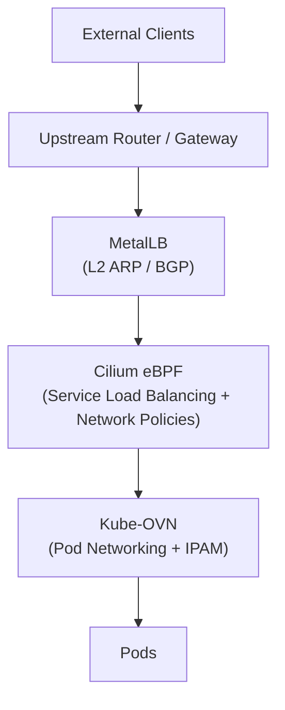

## Cluster Network Configuration

| Parameter | Default Value |
| --- | --- |
| Pod CIDR | 10.244.0.0/16 |
| Service CIDR | 10.96.0.0/16 |
| CNI | Kube-OVN + Cilium (kube-proxy replacement) |

### Pod CIDR Allocation (Kube-OVN)

Kube-OVN uses a **shared Pod CIDR** model:

- All pods draw from a single shared IP pool (10.244.0.0/16)
- IP addresses are allocated centrally through Kube-OVN's IPAM
- There is no per-node CIDR splitting (unlike Calico or Flannel)
- This enables live migration of pods between nodes without changing their IP addresses

## External Traffic Ingress with MetalLB

MetalLB is a load balancer implementation for bare-metal Kubernetes clusters. It assigns external IP addresses to Services of type `LoadBalancer`, allowing external traffic to reach the cluster.

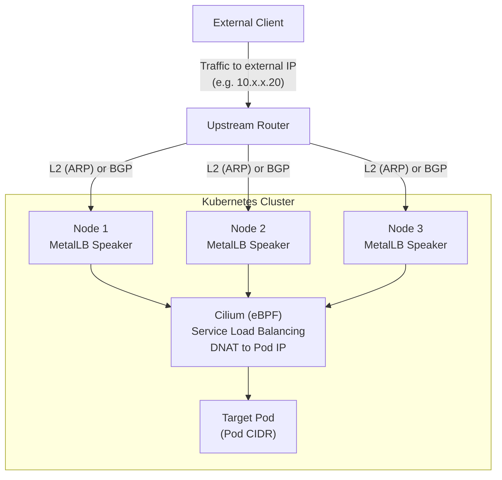

### Layer 2 Mode (ARP)

In L2 mode, MetalLB responds to ARP requests for the Service's external IP. A single node becomes the "leader" for that IP and receives all traffic.

How it works:

1. A MetalLB speaker on one node claims the external IP
2. The speaker responds to ARP requests: "IP X is at MAC aa:bb:cc:dd:ee:ff"
3. All traffic for that IP goes to the leader node
4. Cilium on the node performs DNAT to the actual pod

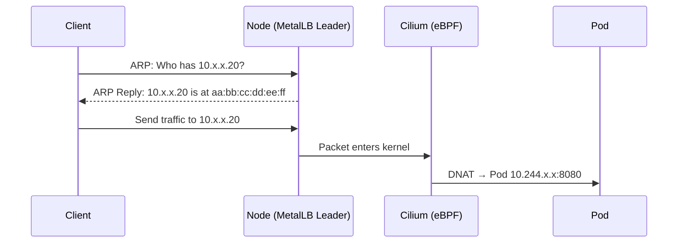

{}
In L2 mode, only one node handles traffic for a given Service IP. Failover occurs if the leader node goes down, but there is no true load balancing across nodes for a single Service.
{}

### BGP Mode

In BGP mode, MetalLB establishes BGP sessions with upstream routers and announces /32 routes for Service IPs. This enables true ECMP load balancing across nodes.

How it works:

1. MetalLB speakers establish BGP sessions with the upstream router(s)
2. Each speaker announces the Service IP as a /32 route
3. The router has multiple next-hops for the same prefix
4. ECMP distributes traffic across nodes
5. Cilium on the receiving node performs DNAT to the actual pod

```mermaid
sequenceDiagram
    participant S1 as Node 1 (Speaker)
    participant S2 as Node 2 (Speaker)
    participant S3 as Node 3 (Speaker)
    participant R as Upstream Router
    participant CIL as Cilium (eBPF)
    participant P as Pod

    S1->>R: BGP UPDATE: 10.x.x.20/32 via Node 1
    S2->>R: BGP UPDATE: 10.x.x.20/32 via Node 2
    S3->>R: BGP UPDATE: 10.x.x.20/32 via Node 3
    Note over R: ECMP: 3 next-hops for 10.x.x.20/32
    R->>S1: Traffic (1/3)
    R->>S2: Traffic (1/3)
    R->>S3: Traffic (1/3)
    S1->>CIL: Packet enters kernel
    CIL->>P: DNAT → Pod
```

### VLAN Integration for External Traffic

External traffic can be delivered to the cluster through additional VLANs (client VLANs, DMZ, public networks, etc.) which are then routed to services via MetalLB and Cilium.

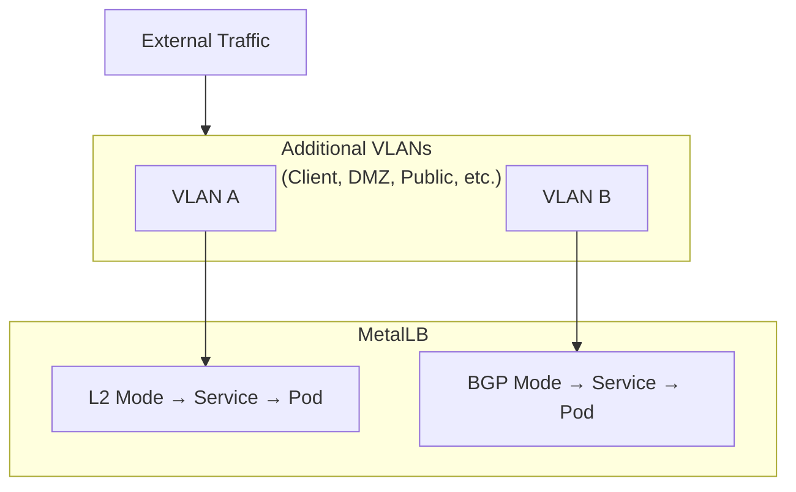

## Cilium as kube-proxy Replacement

Cilium replaces kube-proxy by attaching eBPF programs directly in the Linux kernel. This provides more efficient packet processing and advanced capabilities.

### Traditional kube-proxy (iptables) vs Cilium eBPF

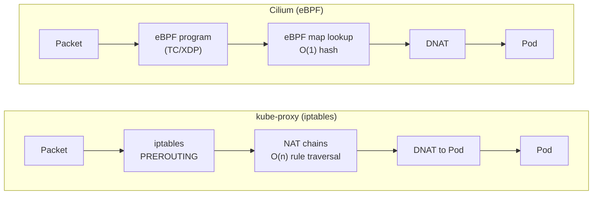

Key differences:

| Aspect | kube-proxy (iptables) | Cilium (eBPF) |
| --- | --- | --- |
| Lookup complexity | O(n) rule traversal | O(1) hash-based lookup |
| Execution context | Userspace overhead | Native in-kernel |
| Context switches | Required | None |
| Scalability | Degrades with service count | Constant performance |

### eBPF Architecture

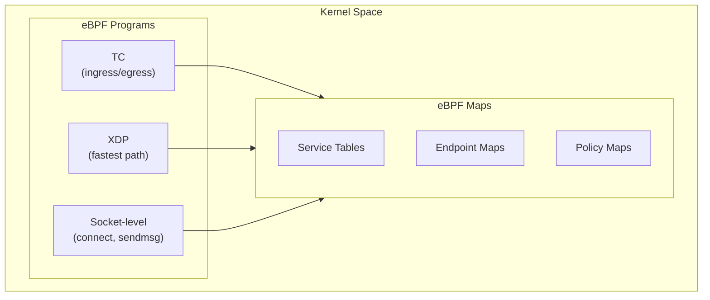

## Tenant Isolation with Kube-OVN and Cilium

In a multi-tenant Cozystack cluster, all tenants share the same Pod CIDR. Kube-OVN manages a single shared IP pool (no per-node splitting), and Cilium enforces strong isolation using eBPF-based network policies.

### CNI Architecture

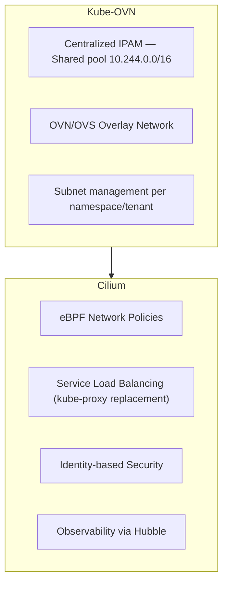

### Tenant Isolation Model

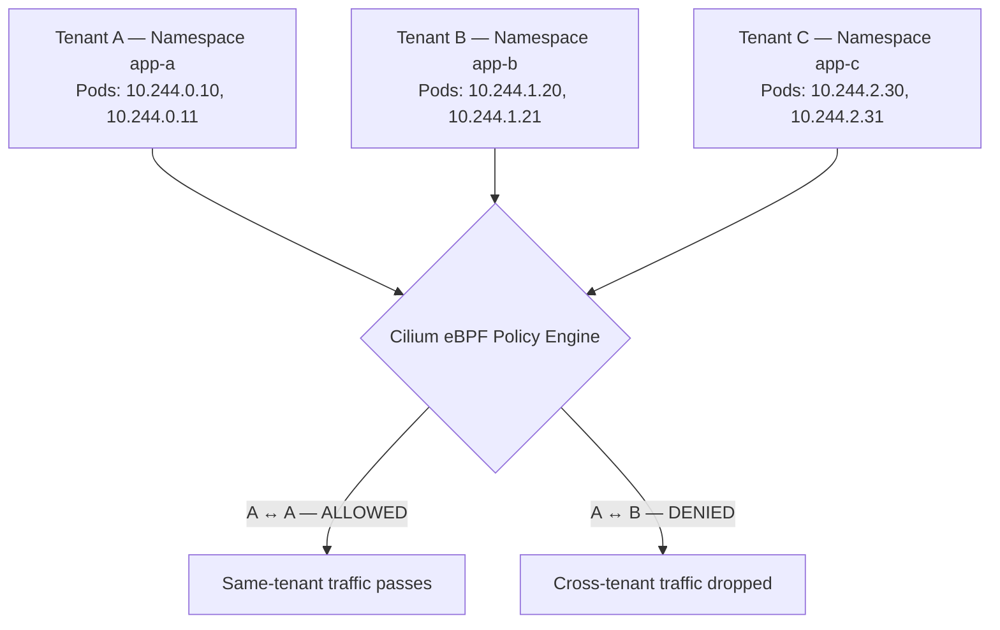

### Identity-based Security

Cilium assigns each endpoint (pod) a **security identity** based on its labels. Policies are enforced using these identities rather than IP addresses.

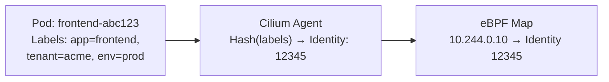

### Policy Enforcement in Kernel

When a packet is sent between pods, Cilium enforces policies entirely within kernel space:

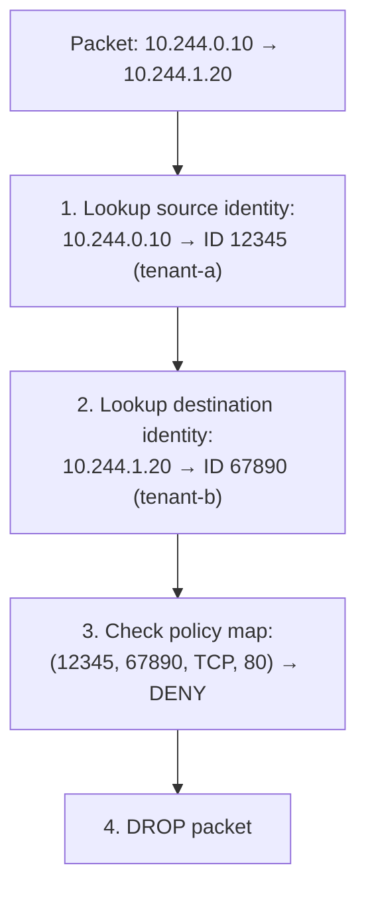

All of this happens in kernel space in approximately 100 nanoseconds.

### Why eBPF Enforcement is Secure

| Property | Description |
| --- | --- |
| **Verifier** | eBPF programs are verified before loading — no crashes, no infinite loops |
| **Isolation** | Programs run in a restricted kernel context |
| **No userspace bypass** | All network traffic must pass through eBPF hooks |
| **Atomic updates** | Policy changes are atomic — no race conditions |
| **In-kernel** | No context switches needed, faster than userspace |

### Kernel-level Enforcement

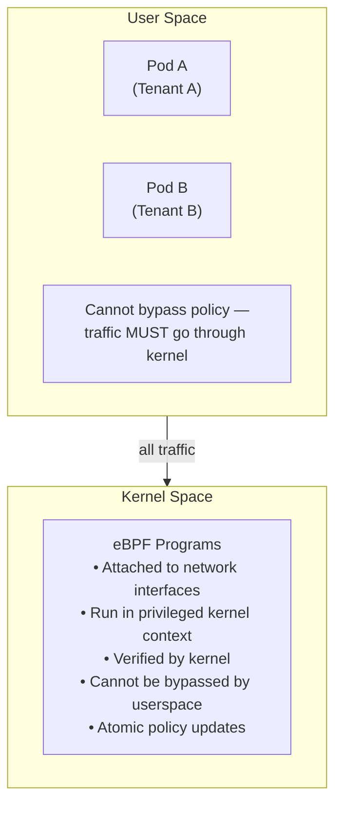

### Default Deny with Namespace Isolation

Example `CiliumNetworkPolicy` for tenant isolation:

```yaml
apiVersion: cilium.io/v2
kind: CiliumNetworkPolicy
metadata:
  name: isolate-tenant
  namespace: tenant-a
spec:
  endpointSelector: {}    # Apply to all pods in namespace
  ingress:
    - fromEndpoints:
        - matchLabels:
            io.kubernetes.pod.namespace: tenant-a  # Only from same namespace
  egress:
    - toEndpoints:
        - matchLabels:
            io.kubernetes.pod.namespace: tenant-a  # Only to same namespace
    - toEntities:
        - kube-apiserver  # Allow API server access
        - cluster         # Allow cluster DNS
```

## Traffic Flow Summary

### External Access

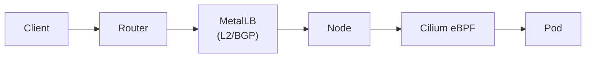

### Tenant Isolation

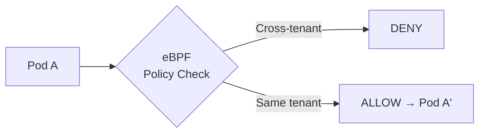
