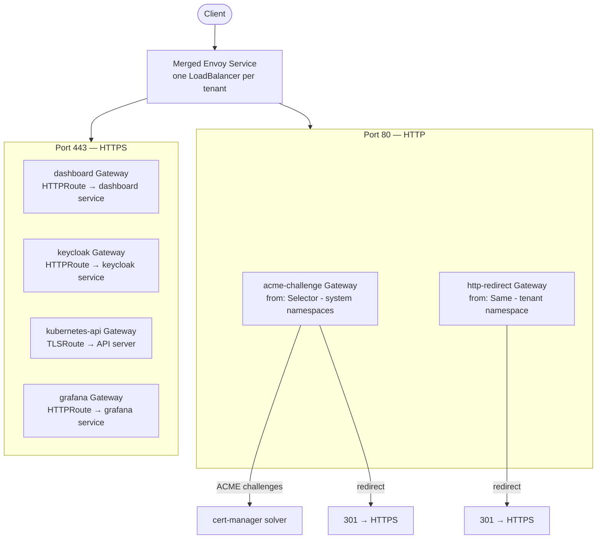
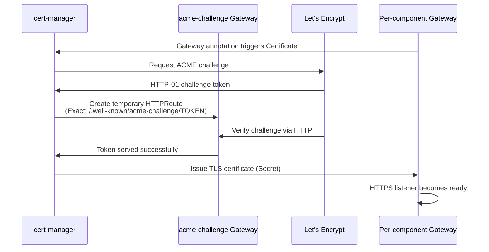

## Prerequisites

- Cozystack v1.2.0 or newer

## Overview

Cozystack supports [Kubernetes Gateway API](https://gateway-api.sigs.k8s.io/) as an alternative to traditional ingress-nginx for traffic routing. The implementation uses [Envoy Gateway](https://gateway.envoyproxy.io/) as the Gateway API controller, providing per-tenant gateway isolation with merged LoadBalancer services.

Gateway API and Ingress can coexist simultaneously — enabling Gateway API does not disable existing Ingress resources.

## Architecture

The gateway model mirrors the ingress-nginx architecture:

| Component | Ingress (nginx) | Gateway API (Envoy) |
| --- | --- | --- |
| Controller | ingress-nginx | Envoy Gateway |
| Per-tenant resource | IngressClass | GatewayClass + EnvoyProxy |
| Per-service routing | Ingress | Gateway + HTTPRoute/TLSRoute |
| TLS termination | Ingress TLS | Gateway HTTPS listener |
| TLS passthrough | nginx annotation | TLSRoute |
| Merged service | One LB per IngressClass | One LB per GatewayClass (mergeGateways) |

### Per-tenant model

Each tenant with `gateway: true` gets its own:

- **GatewayClass** named after the tenant namespace (e.g., `tenant-root`)
- **EnvoyProxy** with `mergeGateways: true` — all per-component Gateways share one LoadBalancer Service
- **acme-challenge Gateway** — shared HTTP listener for ACME HTTP-01 challenges and system service redirects
- **http-redirect Gateway** — catch-all HTTP-to-HTTPS redirect for the tenant's own namespace

System services (dashboard, keycloak, kubernetes-api) and tenant services (grafana, buckets, harbor) create per-component Gateways with HTTPS-only listeners. The Envoy data plane merges all Gateways into a single Service with a shared IP.



### TLS certificate flow



## Enabling Gateway API

### Platform configuration

Enable Gateway API on the platform:

```yaml
apiVersion: cozystack.io/v1alpha1
kind: Package
metadata:
  name: cozystack.cozystack-platform
spec:
  components:
    platform:
      values:
        gateway:
          ingress: true       # Keep ingress enabled (or set to false)
          gatewayAPI: true    # Enable Gateway API
          gatewayClass: tenant-root  # GatewayClass for system services
```

This will:

- Deploy Envoy Gateway controller and CRDs
- Configure cert-manager with Gateway API HTTP-01 solver
- Add `gateway-httproute` and `gateway-tlsroute` sources to external-dns

At least one of `gateway.ingress` or `gateway.gatewayAPI` must be enabled — disabling both will cause a template error since ACME HTTP-01 solvers require at least one routing mechanism.

### Tenant configuration

Enable a per-tenant gateway:

```yaml
apiVersion: apps.cozystack.io/v1alpha1
kind: Tenant
metadata:
  name: root
  namespace: tenant-root
spec:
  gateway: true    # Deploy GatewayClass + EnvoyProxy for this tenant
  host: example.org
  ingress: true    # Can coexist with gateway
```

When `gateway: true` is set, the tenant gets a GatewayClass and EnvoyProxy. All services within the tenant that support Gateway API will create per-component Gateways and HTTPRoutes.

## TLS certificates

### ACME HTTP-01 (Let's Encrypt)

Per-component Gateways use the `cert-manager.io/cluster-issuer` annotation. cert-manager automatically creates Certificate resources for each HTTPS listener and solves ACME challenges through the shared `acme-challenge` Gateway.

The ClusterIssuer is configured with dynamic solvers:

- When `gateway.ingress: true` — adds `http01.ingress` solver (nginx class)
- When `gateway.gatewayAPI: true` — adds `http01.gatewayHTTPRoute` solver (acme-challenge Gateway)
- When both are enabled — both solvers are present
- DNS-01 solver (Cloudflare) is unaffected by this configuration

### Self-signed certificates

The `selfsigned-cluster-issuer` ClusterIssuer works independently of Gateway API — no ACME challenges needed.

### Limitation: child tenant certificates

Gateway API ACME HTTP-01 certificates work for the root tenant and system services. Child tenants with `gateway: true` have their own Gateways, but the ClusterIssuer always references the root tenant's Gateways. ACME challenges from child tenant namespaces will be rejected.

**Workarounds for child tenants:**

- Use `dns01` solver (Cloudflare) — works regardless of namespace
- Use namespace-scoped Issuers instead of ClusterIssuer
- Use self-signed certificates

## HTTP-to-HTTPS redirect

HTTP-to-HTTPS redirect is handled at two levels:

- **System services** (dashboard, keycloak): each creates a redirect HTTPRoute attached to the `acme-challenge` Gateway via namespace selector (`cozystack.io/system` label)
- **Tenant services**: use the `http-redirect` Gateway with `from: Same` for catch-all redirect

The ACME challenge HTTPRoute (Exact path match on `/.well-known/acme-challenge/TOKEN`) always takes priority over the redirect (implicit PathPrefix `/`).

## ExternalIPs

When Ingress is disabled (`gateway.ingress: false`) and `publishing.externalIPs` are configured, the EnvoyProxy patches the merged Service with `type: ClusterIP` and sets `externalIPs` directly on the Service spec.

When Ingress is enabled or no externalIPs are set, the merged Service uses `type: LoadBalancer`.

## Envoy Gateway cluster domain

Envoy Gateway requires the correct Kubernetes cluster domain for xDS communication between the controller and data plane. Cozystack automatically configures this from `networking.clusterDomain` (default: `cozy.local`) via the `global.clusterDomain` value in the cozystack-values secret.

## Supported services

### HTTPRoute (TLS termination)

| Service | Namespace | Condition |
| --- | --- | --- |
| Dashboard | cozy-dashboard | `expose-services` includes `dashboard` |
| Keycloak | cozy-keycloak | OIDC enabled |
| Grafana | tenant namespace | `gateway: true` on tenant |
| Alerta | tenant namespace | `gateway: true` on tenant |
| Bucket UI | tenant namespace | `gateway: true` on tenant |
| Harbor | tenant namespace | `gateway: true` on tenant |
| Bootbox | tenant namespace | `gateway: true` on tenant |

### TLSRoute (TLS passthrough)

| Service | Namespace | Condition |
| --- | --- | --- |
| Kubernetes API | default | `expose-services` includes `api` |
| VM Export Proxy | cozy-kubevirt | `expose-services` includes `vm-exportproxy` |
| CDI Upload Proxy | cozy-kubevirt-cdi | `expose-services` includes `cdi-uploadproxy` |
| SeaweedFS | tenant namespace | `gateway: true` on tenant + SeaweedFS enabled |

## Comparison with Ingress

| Feature | Ingress (nginx) | Gateway API (Envoy) |
| --- | --- | --- |
| HTTP-to-HTTPS redirect | Automatic (nginx default) | Explicit HTTPRoute per service |
| TLS passthrough | nginx annotation | Native TLSRoute resource |
| Session affinity | nginx cookie annotation | Not supported (stateless routing) |
| Merged LoadBalancer | One per IngressClass | One per GatewayClass (mergeGateways) |
| ExternalIPs | Service externalIPs | EnvoyProxy Service patch |
| Certificate management | cert-manager + Ingress | cert-manager + Gateway annotation |
| Multi-tenant isolation | IngressClass per tenant | GatewayClass per tenant |
