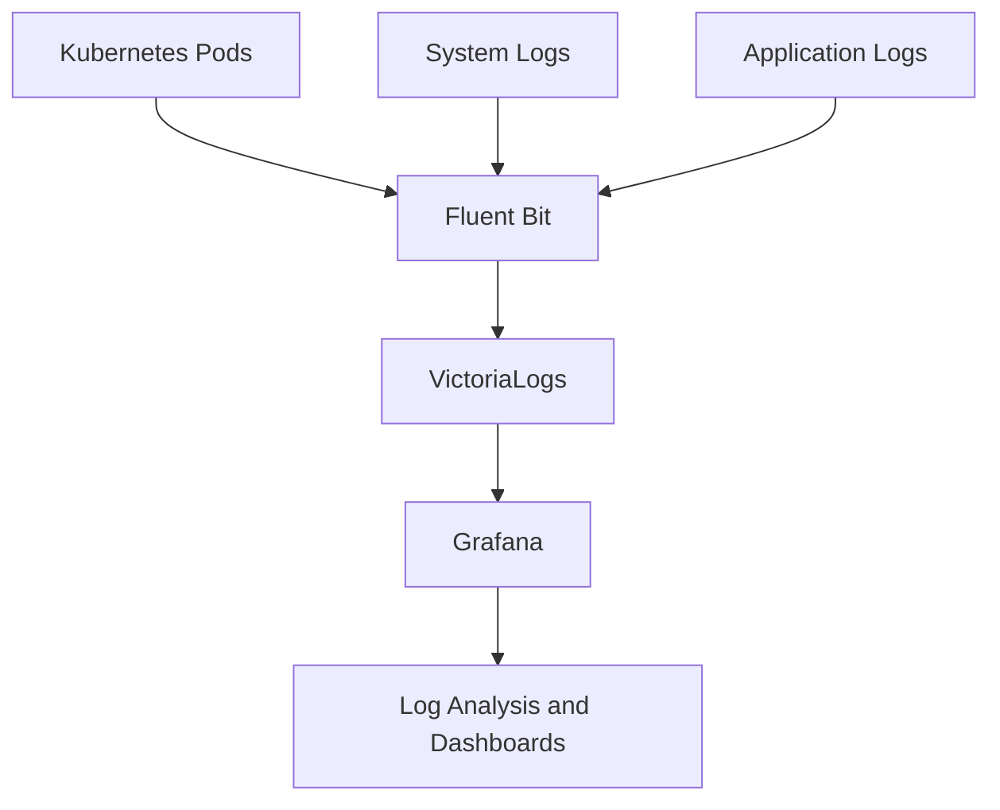

## Collecting and Storing Logs

Cozystack uses Fluent Bit for log collection and VictoriaLogs for log storage and querying. Logs are collected from various sources within the cluster and stored in dedicated log storages configured per tenant.

### Configuring Logs Storages

Log storages are configured through the monitoring hub parameters. Each tenant can have multiple log storage instances with customizable retention periods and storage sizes.

| Parameter | Description | Type | Default |
|-----------|-------------|------|---------|
| `logsStorages` | Array of log storage configurations | `[]object` | `[]` |
| `logsStorages[i].name` | Name of the storage instance | `string` | `""` |
| `logsStorages[i].retentionPeriod` | Retention period for logs (e.g., "30d") | `string` | `"1"` |
| `logsStorages[i].storage` | Persistent volume size | `string` | `"10Gi"` |
| `logsStorages[i].storageClassName` | StorageClass for data persistence | `string` | `"replicated"` |

For detailed configuration options, see [Monitoring Hub Reference]({}).

### Fluent Bit Inputs and Outputs

Fluent Bit is configured to collect logs from:

- **Kubernetes Pods**: Container logs from all namespaces
- **System Logs**: Node-level logs and system services
- **Application Logs**: Custom log sources via sidecar containers

#### Example Fluent Bit Input Configuration

```yaml
apiVersion: v1
kind: ConfigMap
metadata:
  name: fluent-bit-config
data:
  fluent-bit.conf: |
    [INPUT]
        Name              tail
        Path              /var/log/containers/*.log
        Parser            docker
        Tag               kube.*
        Refresh_Interval  5

    [OUTPUT]
        Name  vlogs
        Match kube.*
        Host  vlogs-cluster
        Port  9428
```

Logs are forwarded to VictoriaLogs for storage and indexing. The output plugin ensures logs are enriched with metadata like pod names, namespaces, and timestamps.

## Logging Architecture

The following diagram illustrates the logging architecture in Cozystack, showing how logs flow from various sources to storage and visualization tools.



## Searching and Analyzing Logs

VictoriaLogs (VLogs) provides powerful querying capabilities for stored logs. Access VLogs through Grafana or directly via API for advanced log analysis.

### Using VictoriaLogs

- **Query Language**: Use VLogs query syntax to filter logs by fields, time ranges, and patterns.
- **Integration with Grafana**: Visualize logs alongside metrics in dashboards.

#### Example VLogs Query

To search for error logs from a specific pod:

```text
_level:ERROR AND kubernetes_pod_name: "my-app-pod"
```

### Filters and Metadata

Logs in Cozystack include rich metadata for effective filtering:

- **Pod Metadata**: `kubernetes_pod_name`, `kubernetes_namespace_name`, `kubernetes_container_name`
- **Tenant**: `tenant` — identifies which tenant the logs belong to
- **Log Levels**: `_level` (INFO, WARN, ERROR, etc.)
- **Timestamps**: Automatic timestamp parsing
- **Custom Labels**: Application-specific labels added during collection

#### Advanced Filtering

Use complex queries to correlate logs:

```text
kubernetes_namespace_name: "kube-system" AND _level: "WARN" AND _msg: *timeout*
```

For more on VLogs querying, refer to the [VictoriaLogs documentation](https://docs.victoriametrics.com/victorialogs/).

## Viewing Tenant Kubernetes Cluster Logs

When running workloads in a [tenant Kubernetes cluster]({}), their logs are collected and forwarded to the parent tenant's VictoriaLogs instance. You can then query these logs in Grafana using specific label filters.

### Prerequisites

Enable the `monitoringAgents` addon on the tenant Kubernetes cluster. This deploys agents inside the cluster that collect logs and forward them to VictoriaLogs.

Via the Cozystack dashboard, set `addons.monitoringAgents.enabled: true` in the Kubernetes application parameters, or apply it programmatically:

```yaml
addons:
  monitoringAgents:
    enabled: true
```

See [Managed Kubernetes parameters]({}) for details.

### Log Labels

Logs from tenant Kubernetes clusters are enriched with the following labels:

| Label | Description | Example |
| --- | --- | --- |
| `tenant` | Tenant identifier (format: `tenant-<name>`) | `tenant-workload` |
| `kubernetes_namespace_name` | Namespace within the tenant Kubernetes cluster | `default` |
| `kubernetes_pod_name` | Pod name | `my-app-6b7b8c9b89-ccqgf` |
| `kubernetes_container_name` | Container name within the pod | `my-app` |

### Querying Logs in Grafana

1. Open Grafana at `https://grafana.<tenant-host>`
2. Navigate to **Explore**
3. Select the **VictoriaLogs** datasource
4. Use the query builder or write a query directly

#### Filter all logs from a tenant

```text
tenant: "tenant-workload"
```

#### Filter by tenant and namespace

```text
tenant: "tenant-workload" AND kubernetes_namespace_name: "default"
```

#### Filter logs for a specific pod

```text
tenant: "tenant-workload" AND kubernetes_namespace_name: "default" AND kubernetes_pod_name: "my-app-6b7b8c9b89-ccqgf"
```

## Integrating with Applications

To maximize log observability, integrate structured logging and label enrichment in your applications.

### Structured Logs

Use structured logging formats like JSON for better parsing and querying:

```json
{
  "timestamp": "2023-10-01T12:00:00Z",
  "level": "INFO",
  "message": "User login successful",
  "user_id": "12345",
  "action": "login"
}
```

### Enriching Logs with Labels

Add custom labels to logs for enhanced filtering:

- **Tenant Labels**: Automatically added for multi-tenancy
- **Application Labels**: Custom labels like `app_version`, `environment`
- **Business Labels**: Domain-specific metadata

#### Example Application Configuration

In your application, configure logging to include structured data:

```python
import logging
import json

logger = logging.getLogger(__name__)

def log_event(level, message, **kwargs):
    log_entry = {
        "timestamp": datetime.utcnow().isoformat(),
        "level": level,
        "message": message,
        **kwargs
    }
    logger.info(json.dumps(log_entry))
```

Ensure Fluent Bit parsers are configured to handle your log format. For setup details, see [Monitoring Setup]({}).